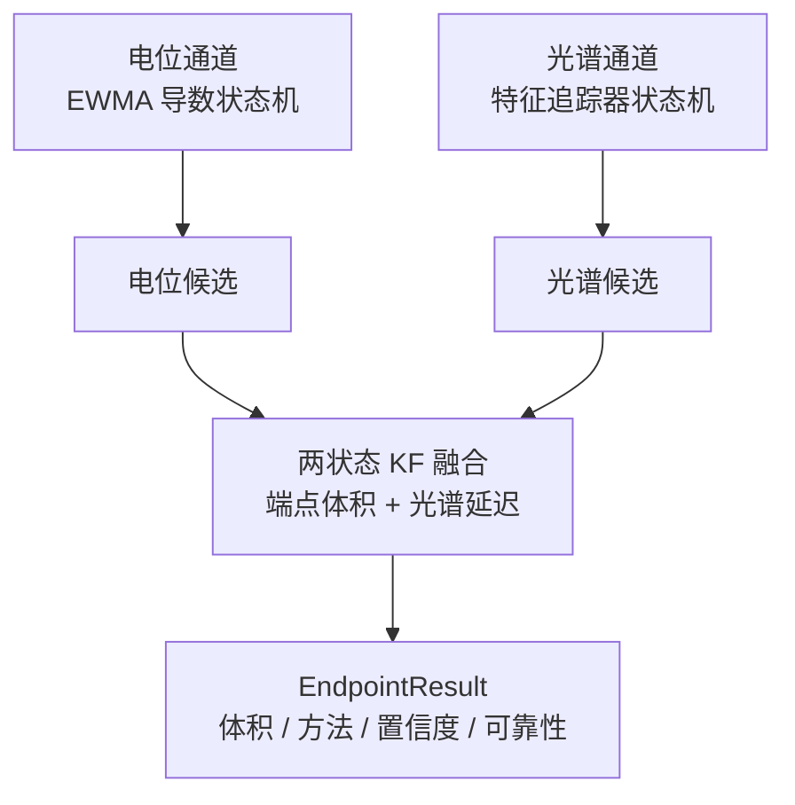

# 算法技术报告：多模态融合与滴定终点判定

[English](algorithm-report_EN.md) | 中文

本文档描述 AutoTitrator 在线滴定终点判定的实际算法实现，包括电位通道、光谱通道、两状态卡尔曼融合、最终微调与可靠性诊断。实现代码在 `TController/crates/controller-core/src/processing/`，工作流接线在 `src/workflow.rs`。协议与数据格式见配套文档。

## 1. 问题与总体设计

滴定过程：进样泵抽取样品到反应容器，滴定泵以固定速度加滴定剂。终点是化学计量点附近电位或光谱的剧烈变化点，在线判定必须在加液过程中实时给出，且只用已采集到的样本（因果）。

系统用两条相互独立的通道各自产生终点候选，再用卡尔曼滤波器融合：

两条通道都只消费历史样本。任一模态的终点都可能事后修正（光谱候选被更强激变顶替、电位候选被 AMPD 微调），所以观测对变化时 KF 从头重跑，避免用陈旧状态门控修正值。

## 2. 电位通道

电位通道的目标是在 dV/dV 曲线中定位最陡的下降点。实现分成三步：平滑、阈值估计、状态机。

### 2.1 平滑

电压与导数各过一个一阶因果 EWMA：

$$
v_{\text{sm},t} = \alpha_v \, v_t + (1-\alpha_v)\, v_{\text{sm},t-1}, \qquad \alpha_v = 0.15
$$

$$
d_t = \frac{v_{\text{sm},t} - v_{\text{sm},t-1}}{t_t - t_{t-1}}, \qquad
d_{\text{sm},t} = \alpha_d \, d_t + (1-\alpha_d)\, d_{\text{sm},t-1}, \qquad \alpha_d = 0.05
$$

### 2.2 阈值估计（观察期）

累计体积未超过 `POT_OBSERVE_VOL = 0.1` mL 前，只收集导数样本。观察期结束时用无偏样本标准差设两个阈值（在负方向，因为终点处导数明显向下）：

$$
\text{enter\_th} = \bar d - \max(\text{POT\_MIN\_ENTER},\, 2.5\,\sigma_d), \qquad \text{POT\_MIN\_ENTER} = 0.005
$$

$$
\text{exit\_th} = \bar d - \max(\text{POT\_MIN\_EXIT},\, 2.5\,\sigma_d), \qquad \text{POT\_MIN\_EXIT} = 0.001
$$

### 2.3 状态机

- `Idle` → `Tracking`：平滑导数跌破进入阈值，记录候选体积。
- `Tracking`：导数创新低时更新候选体积为最低点。
- `Tracking` → `EndConfirmed`：导数回升超过退出阈值，且自进入点起的体积增量超过 `POT_CONFIRM_VOL = 0.15` mL。

确认后的候选即电位终点。阈值与进入退出参数取 $2.5\sigma$，是实测中能在噪声基底上工作、又不至于把正常起伏误判为终点的折中。

## 3. 光谱通道

光谱通道把「形状变化」转化为一个标量速度，再驱动一个可重入状态机。主要度量是 Jensen–Shannon 散度。

### 3.1 度量选择

早期实现用交叉熵做事件驱动：

$$
\text{CE}(p, q) = - \sum_i p_i \log q_i
$$

它有一个结构性缺陷：$\text{CE}(p, p)$ 等于 p 的熵（约 $\ln n$），不是 0。除以体积步长平方后，速度信号从第一帧起就稳定在一个高值，永远高于退出阈值，状态机无法离开变化状态。改用 JS 散度后，$\text{JS}(p, p) = 0$，且对称、有界（值域 $[0,\, \ln 2]$）：

$$
\text{JS}(p, q) = \frac{1}{2} \sum_i p_i \ln\frac{p_i}{(p_i+q_i)/2} + \frac{1}{2} \sum_i q_i \ln\frac{q_i}{(p_i+q_i)/2}
$$

$\text{cross\_entropy\_excess}$（= $\text{KL}(p \| q)$，减去自身下界后为 0）作为 `use_jsd = false` 的兼容路径保留，不驱动默认状态机。

### 3.2 体积归一化速度

速度定义为当前平滑谱与**最后一个前进帧锚点**的 JS 散度除以体积步长平方：

$$
s_t = \frac{\text{JS}(\tilde p_t,\, \tilde p_{\text{anchor}})}{\Delta V_t^2}
$$

锚定前进帧是刻意的。生产中一个泵体积对应多帧光谱，若锚定上一帧，重复体积帧会注入零步长、把真实事件稀释掉；锚定前进帧让速度滤波器在体积静止时保持电平，不输入零值。

**舍入下界**：float64 上真实 8 通道帧的 JS 舍入底约 5e-17，平台期约 2e-12，除以 $\Delta V^2$（约 2.4e-8）会被放大约 4e7 倍，变成算术噪声。因此：

$$
s_t = 0 \quad \text{当} \quad \text{JS}(\tilde p_t,\, \tilde p_{\text{anchor}}) \le \text{JS\_FLOOR} = 10^{-14}
$$

### 3.3 基线

在体积不超过 `SPEC_BASELINE_MAX_VOL = 0.30` mL 且帧数未达 `SPEC_BASELINE_FRAMES = 12` 前，逐帧累加归一化谱，取平均作为基线。基线 JS 用 `SPEC_BASELINE_ENTER = 3e-7` 作为进入事件的必要条件，避免基线未建立时误触发。

### 3.4 状态机（可重入）

- `Idle` / `EndConfirmed` → `InChange`：平滑速度 $\ge$ `SPEC_JS_ENTER = 0.05` 且基线 JS $\ge$ `3e-7`。用保留窗口（lookback 8 帧）播种峰值，让候选定位到窗口内速度最强的帧，而不是首个越过阈值的穿越点。
- `InChange`：速度创下新高时更新峰值；速度回落 $\le$ `SPEC_JS_EXIT = 0.008` 时累计恢复帧数。
- `InChange` → `EndConfirmed`：恢复帧数 $\ge$ `SPEC_CONFIRM_FRAMES = 10`，且自进入点体积增量 $\ge$ `SPEC_MIN_EVENT_VOL = 0.08` mL。

`EndConfirmed` 可重入：激变记入事件列表，报告的终点是迄今最强事件；只有后发事件峰值速度超过旧峰值 `SPEC_SUPERSEDE_RATIO = 1.5` 倍才顶替。这个滞回修复了一次实际回归：一次性闩锁曾把早于真终点 0.97 mL 的瞬态锁成终点，而 KF 门控只能拒绝、无法修正。

## 4. 两状态卡尔曼融合

融合层把电位终点与光谱终点组合成一个估计。两状态线性 KF：状态 = [终点体积, 光谱延迟]。

$$
x = \begin{bmatrix} V_{\text{ep}} \\ \delta \end{bmatrix}, \qquad
H_{\text{pot}} = [1, 0], \qquad H_{\text{spec}} = [1, 1]
$$

电位观测直接是终点体积；光谱观测 = 终点 + 延迟，因此延迟被估计出来。

### 4.1 观测模型与方差

| 参数 | 值 |
|---|---|
| 电位观测噪声 std | 0.012 |
| 光谱观测噪声 std | 0.025 |
| 延迟 std | 0.08 |
| 过程噪声 std | 0.004 |
| 延迟先验 | 0.02 |
| NIS 门 | 6.635 |

首次观测决定初始化：首个电位观测把状态设为 $[z,\, 0]$，首个光谱观测设为 $[z - \delta_0,\, \delta_0]$。之后的观测走标准预测-更新，用 token 去重，同一观测幂等。

### 4.2 NIS 门控

每次观测的新息是标量，把它归一化后与自由度为 1 的卡方分布比较：

$$
\text{NIS} = \frac{(z - H x^-)^2}{H P^- H^\top + R}, \qquad \text{接受当 NIS} \le 6.635
$$

6.635 是自由度为 1 的卡方分布 99 分位。旧实现用了自由度为 2 的 99 分位 9.21，自由度错配导致判定边界过宽，已修正。被拒绝的观测不更新状态，记入快照供诊断。

### 4.3 观测对变化时重新融合

光谱候选被顶替、电位候选被 AMPD 微调，都会改变观测对。`endpoint.rs` 检测到观测对变化时先 `kf.reset()` 再重新观测，避免用陈旧状态门控修正值拒绝修正。

## 5. 汇总结案

`detect()` 按双通道候选与 KF 融合能力返回结果：

| 电位 | 光谱 | KF 可融合 | method | confidence |
|---|---|---|---|---|
| 有 | 有 | 是 | consensus | high |
| 有 | 有 | 否（KF 关闭且 $\lvert\Delta V\rvert < 0.3$） | consensus | high |
| 有 | 有 | 否（未过 NIS 门控） | conflict | low |
| 有 | 无 | — | potential_only | medium |
| 无 | 有 | — | spectral_only | medium |

`conflict` 的语义是「双模态都确认但未过 NIS 门控，退回电位终点」，它仍有电位证据，因此工作流以电位为判据控制泵。`spectral_only` 没有电极证据，工作流不以它为判据控制泵。

## 6. 最终微调（AMPD）

滴定到达 $2 \times$ T=1 体积或手动停止时，对电位导数做离线微调。AMPD（自动多尺度峰值检测）在取负的导数序列上找最显著峰，实现上逐尺度即时归约而不是物化稠密矩阵：

- 需要至少 20 个导数样本。
- 峰位必须落在 `AMPD_MAX_POSITION = 0.9` 以内：最大尺度只覆盖窗口中部，尾部峰的尺度支持很少，0.75 曾在稍晚于化学计量点产生假阳性，故将门限放宽到 0.9。
- 微调结果覆盖候选终点，并触发 KF 重新融合。

## 7. 可靠性诊断

`Reliability` 汇总状态与原因码：

| 状态 | 含义 |
|---|---|
| CONFIRMED | 双通道均确认且 KF 融合 |
| CONFLICT | 双通道均确认但未过 NIS 门控 |
| CANDIDATE | 单通道确认 |
| CONFIRMING | 任一通道在追踪中 |
| UNOBSERVABLE | 无数据 |
| EARLY_WARNING | 已有部分数据但无候选 |

诊断还携带数据质量（电位/光谱样本数、有效帧、重复体积、非单调体积、基线就绪）、KF 快照（endpoint_std、NIS、新息）与原因码（`kf_innovation_gate`、`spectral_endpoint_superseded`、`baseline_pending` 等），随 `backend://state` 快照推送给前端。

## 8. 参数速查

| 通道 | 参数 | 值 | 含义 |
|---|---|---|---|
| 电位 | POT_V_ALPHA / POT_D_ALPHA | 0.15 / 0.05 | 电压、导数 EWMA |
| 电位 | POT_ENTER/EXIT_SIGMA | 2.5 / 2.5 | 阈值 $\sigma$ 倍数 |
| 电位 | POT_CONFIRM_VOL | 0.15 mL | 确认所需体积增量 |
| 光谱 | SPEC_JS_ENTER / EXIT | 0.05 / 0.008 | JS 速度进入/退出阈值 |
| 光谱 | SPEC_SUPERSEDE_RATIO | 1.5 | 顶替滞回倍数 |
| 光谱 | JS_FLOOR | 1e-14 | 舍入下界 |
| KF | DEFAULT_NIS_GATE | 6.635 | 卡方分布（自由度 1）99 分位 |
| AMPD | AMPD_MAX_POSITION | 0.9 | 微调峰位上限 |

## 9. 验证

- 单元测试 `tests/endpoint_reliability.rs` 把行为约定写成测试：JS 对称有界、特征因果、重复体积保持电平、顶替滞回、舍入下界、KF 重置、AMPD 与稠密参照实现一致。
- `tests/workflow.rs` 防止 T=1 时的死锁回归：当双模态冲突时我们取电位数据作为 T=1 的判据；仅光谱时不控泵。
- `tests/tmp_diff_python.rs` 是一次性差分测试，依赖仓库外的本地生成数据 `tmp_diff/dataA_python.json`，与 Python 参考实现在真实滴定数据上逐帧比对；缺文件时自动跳过。
