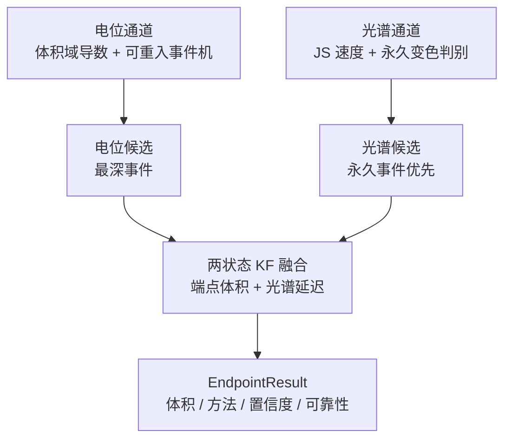

# 算法技术报告：多模态融合与滴定终点判定

[English](algorithm-report_EN.md) | 中文

本文档描述 AutoTitrator 在线滴定终点判定的实际算法实现，包括电位通道、光谱通道、两状态卡尔曼融合、最终微调与可靠性诊断。实现代码在 `TController/crates/controller-core/src/processing/`，工作流接线在 `src/workflow.rs`。协议与数据格式见配套文档。

## 1. 问题与总体设计

滴定过程：进样泵抽取样品到反应容器，滴定泵以固定速度加滴定剂。终点是化学计量点附近电位或光谱的剧烈变化点，在线判定必须在加液过程中实时给出，且只用已采集到的样本（因果）。

系统用两条相互独立的通道各自产生终点候选，再用卡尔曼滤波器融合：

两条通道都只消费历史样本。任一模态的终点都可能事后修正（光谱候选被更强激变顶替、电位候选被 AMPD 微调），所以观测对变化时 KF 从头重跑，避免用陈旧状态门控修正值。

**自适应阈值**是 2026-08 重构的主线：电位与光谱两通道的触发阈值都不再是纯固定常数，而是从各自基线期的稳健统计（中位数 / MAD）在线估计，固定常数降级为下限兜底。设计三约束贯穿全部实现：

1. **因果**：统计只来自基准建立前的样本；
2. **退化安全**：零散布（MAD → 0）时回落到固定常数下限，平坦合成数据上的行为与旧版逐位一致（有测试锁定）；
3. **有界**：估计结果被上限裁剪，防御基线窗本身被异常扰动污染的情形。

## 2. 电位通道

电位通道的目标是在 $dE/dV$ 曲线中定位最陡的下降点。实现分成四步：体积域差分、平滑、阈值估计、可重入事件机。

### 2.1 导数按体积差分（2026-08 重构）

导数的自变量从时间改成了体积：

$$
d_t = \frac{E_{\text{sm},t} - E_{\text{sm},t-1}}{V_t - V_{t-1}} \quad (\text{V/mL})
$$

动因是实测教训：上位机时间戳存在微突发（2026-08-26 数据中 $\Delta t < 50$ ms 的样本占 15%，最小为 0），按时间差分使孤立样本产生 $-1159$ mV/s 量级的伪影尖峰，经 EWMA 尾巴拖成假下陷，曾把终点锁在 0.735 mL 而真实突跃在 5.3–6.3 mL。体积由泵步数量化，天然免疫计时抖动，且与光谱通道的体积锚定语义同构。

体积步长低于 `POT_DV_FLOOR = 1e-4` mL（重复帧）或为负（非单调）时，导数保持上一水平（hold），与光谱通道的体积锚定语义一致。

### 2.2 平滑

电压与导数各过一个一阶因果 EWMA（$\alpha_v = 0.15$、$\alpha_d = 0.05$，与旧版一致）。

### 2.3 阈值估计（观察期）

累计体积未超过 `POT_OBSERVE_VOL = 0.1` mL 前，只收集导数样本。观察期结束时计算稳健统计：中位水平 $\tilde\mu_d$ 与 MAD 噪声尺度（$1.4826\times$ 中位绝对偏差）。MAD 对观察窗内的孤立离群值不敏感，避免样本标准差被离群导数膨胀。

进入/退出阈值用相对梯子：

$$
\Delta_{\text{enter}} = \mathrm{clip}(2.5\,\hat\sigma_d,\; \underbrace{0.02}_{\text{POT\_MIN\_ENTER}},\; \underbrace{5.0}_{\text{POT\_MAX\_ENTER}}), \qquad
\theta_{\text{enter}} = \tilde\mu_d - \Delta_{\text{enter}},\quad \theta_{\text{exit}} = \tilde\mu_d - 0.2\,\Delta_{\text{enter}}
$$

- **下限 0.02 V/mL**：极低噪声（零散布使 MAD 退化为零）时回落到固定行为；
- **上限 5.0 V/mL**：防御观察窗本身被异常扰动污染、把阈值顶到不可触发；
- 退出偏移按进入偏移的固定比例（`POT_EXIT_RATIO = 0.2`）派生。

MAD 统计不可用（样本退化）时退回均值–标准差公式（同型 clip）。

### 2.4 状态机（可重入，2026-08 重构）

- `Idle` / `EndConfirmed` → `Tracking`：平滑导数跌破进入阈值。
- `Tracking`：导数创新低时更新候选体积；回升超过退出阈值且自进入点体积增量超过 `POT_CONFIRM_VOL = 0.15` mL 时提交为一次**确认事件**，回到 `EndConfirmed`（可重新进入）。
- 报告的终点是**最深事件**（导数极小值最深者）的候选体积；后发事件须比当前最强者深 `POT_SUPERSEDE_RATIO = 1.5` 倍才顶替。

旧实现是一次性闩锁（首次确认即锁定、忽略全部后续下陷）。2026-08-26 实测数据上它锁在噪声引起的浅陷、完全错过 5.3–6.3 mL 的真实突跃——与光谱通道曾因早期瞬态误锁的教训同构，故统一为最强事件语义。

## 3. 光谱通道

光谱通道把「形状变化」转化为一个标量速度，再驱动一个可重入状态机；事件提交时叠加**永久变色判别**。主要度量是 Jensen–Shannon 散度。

### 3.1 度量选择

早期实现用交叉熵做事件驱动，它有结构性缺陷：$\text{CE}(p, p)$ 等于 p 的熵（约 $\ln n$），不是 0，除以体积步长平方后速度信号永远高于退出阈值。改用 JS 散度后 $\text{JS}(p, p) = 0$，且对称、有界（$[0, \ln 2]$）。`cross_entropy_excess`（= KL，减去自身下界后为 0）作为 `use_jsd = false` 的兼容路径保留。

### 3.2 体积归一化速度

速度定义为当前平滑谱与**最后一个前进帧锚点**的 JS 散度除以体积步长平方：

$$
s_t = \frac{\text{JS}(\tilde p_t,\, \tilde p_{\text{anchor}})}{\Delta V_t^2}
$$

锚定前进帧是刻意的：生产中一个泵体积对应多帧光谱，锚定上一帧会让重复体积帧注入零步长、把真实事件稀释掉。低于舍入下界 `JS_FLOOR = 1e-14` 的散度不参与归一化（float64 上平台期噪声约 2e-12，$\Delta V^2$ 放大后是算术噪声）。

### 3.3 基线与自适应阈值

基线在体积 ≤ `SPEC_BASELINE_MAX_VOL = 0.30` mL、帧数 = `SPEC_BASELINE_FRAMES = 12` 时建立。

自适应阈值（可独立开关）在基准建立时从两路稳健统计武装：

| 阈值 | 估计源 | 公式（K=8） | 下限 / 上限 |
|---|---|---|---|
| 进入 `θ_enter` | 基线期推进帧的速度分布 | median + K·σ̂_MAD | 0.05 / 0.5 nats/mL² |
| 退出 `θ_exit` | 进入值的固定比例派生 | 0.16 × θ_enter | — |
| 基准 `θ_base` | 基线帧对最终基准谱的 JS 残差 | median + K·σ̂_MAD | 3e-7 / 5e-5 |

上限防御实测出现过的场景：基线窗被早期强瞬态污染（基线窗内中位速度已达 0.26 nats/mL²），无上限时自适应阈值会被顶到不可触发。统计不足（推进帧 < 6）时基准窗自动延展至 0.45 mL；仍不足则全程使用固定常数。

### 3.4 状态机（可重入）

- `Idle` / `EndConfirmed` → `InChange`：平滑速度 ≥ 进入阈值且基线 JS ≥ 基准阈值。用保留窗口（lookback 8 帧）播种峰值，让候选定位到速度最强的帧。
- `InChange`：速度创新高时更新峰值；速度回落 ≤ 退出阈值时累计恢复帧数。
- `InChange` → `EndConfirmed`：恢复帧数 ≥ `SPEC_CONFIRM_FRAMES = 10` 且事件体积跨度 ≥ `SPEC_MIN_EVENT_VOL = 0.08` mL；**或**平台路径（见下）。

`EndConfirmed` 可重入：激变记入事件列表。这个滞回设计修复了一次实际回归：一次性闩锁曾把早于真终点 0.97 mL 的瞬态锁成终点。

### 3.5 永久变色判别（2026-08 新增）

单靠速度阈值无法区分两类化学性质不同的谱形变化：

- **瞬态激变**：扰动致变色后又完全褪回事件前水平（恢复比 ≈ 1×）；
- **终点形态切换**：指示剂变色、部分褪色但稳定在显著高于事件前的新水平（实测台阶比 ~3200×）。

判据是基准距离的**自参照恢复缺口**：每事件记录提交时的事件前安静段中位水平 $\ell_{\text{pre}}$ 与恢复尾中位 $\ell_{\text{post}}$：

$$
\ell_{\text{post}} \;\ge\; 3.0 \times \ell_{\text{pre}} + \theta_{\text{base}}
\quad\Rightarrow\quad \text{永久变色}
$$

用相对比（对事件前水平）而非对初始基准，使累积稀释等慢漂移自然抵消。三层机制：

1. **提交时初判**：按上式快照 `permanent` 标记；
2. **追溯降级**：瞬态提交瞬间恢复尾可能尚未回落而被误判为永久；后续安静帧以当前水平复评，不再支持即降级并重选最强事件；
3. **平台确认**：强噪声体系中速度长期高于退出门限时，若事件内基准距离前/后半窗中位数收敛（±35%）且显著抬升，同样提交——「阶跃持稳」形态，实测曾使状态机在整个滴定过程卡死在 InChange。

选择规则相应升级：**永久事件无条件压过瞬态事件**（不论峰值速度），同层内维持 1.5× 超驰滞回。判别开关（`permanent_color`）独立于自适应阈值估计，可与固定阈值组合；`legacy_fixed` 模式全部关闭、行为与旧版逐位一致。

## 4. 两状态卡尔曼融合

融合层把电位终点与光谱终点组合成一个估计。两状态线性 KF：状态 = [终点体积, 光谱延迟]。

$$
x = \begin{bmatrix} V_{\text{ep}} \\ \delta \end{bmatrix}, \qquad
H_{\text{pot}} = [1, 0], \qquad H_{\text{spec}} = [1, 1]
$$

电位观测直接是终点体积；光谱观测 = 终点 + 延迟，因此延迟被估计出来。

### 4.1 观测模型与方差

| 参数 | 值 |
|---|---|
| 电位观测噪声 std | 0.012 |
| 光谱观测噪声 std | 0.025 |
| 延迟 std | 0.08 |
| 过程噪声 std | 0.004 |
| 延迟先验 | 0.02 |
| NIS 门 | 6.635 |

首次观测决定初始化：首个电位观测把状态设为 $[z,\, 0]$，首个光谱观测设为 $[z - \delta_0,\, \delta_0]$。之后的观测走标准预测-更新，用 token 去重，同一观测幂等。

### 4.2 观测方差的噪声质量缩放（2026-08 新增）

固定观测方差隐含了标定时的信噪比假设；强噪声体系中固定 R 会高估模态置信、使 NIS 门控偏松。每轮滴定在首条观测消费前，按归一化噪声比 $\rho$（电位：观察窗 MAD σ̂ 与最深下陷深度之比；光谱：基线期速度 MAD 与最强事件峰值速度之比）一次性缩放：

$$
R_m \leftarrow R_m \times \mathrm{clip}\left[(\rho_m / \rho_{\text{ref},m})^2,\; 1,\; 4\right]
$$

参考值 $\rho_{\text{ref}}$: 电位 0.02、光谱 0.02（体积域）。**单边放大**设计：下界 1 保证干净数据（统计缺失按 1 处理）上 NIS 数值行为与既有结果完全一致；上界 4 防止极端噪声把门控完全失效。收紧方向（g < 1）代码已支持、刻意禁用，待有干净双模态基线数据校准后再启用。

### 4.3 NIS 门控

每次观测的新息是标量，归一化后与自由度为 1 的卡方分布比较（99 分位 6.635；旧实现的 9.21 属自由度错配，已修正）。被拒绝的观测不更新状态，记入快照供诊断。

### 4.4 观测对变化时重新融合

光谱候选被顶替、电位候选被 AMPD 微调，都会改变观测对。`endpoint.rs` 检测到观测对变化时先 `kf.reset()` 再重新观测，避免用陈旧状态门控修正值拒绝修正。

## 5. 汇总结案

`detect()` 按双通道候选与 KF 融合能力返回结果：

| 电位 | 光谱 | KF 可融合 | method | confidence |
|---|---|---|---|---|
| 有 | 有 | 是 | consensus | high |
| 有 | 有 | 否（KF 关闭且 $\lvert\Delta V\rvert \lt 0.3$） | consensus | high |
| 有 | 有 | 否（未过 NIS 门控） | conflict | low |
| 有 | 无 | — | potential_only | medium |
| 无 | 有 | — | spectral_only | medium |

`conflict` 的语义是「双模态都确认但未过 NIS 门控，退回电位终点」，它仍有电位证据，因此工作流以电位为判据控制泵。`spectral_only` 没有电极证据，工作流不以它为判据控制泵。

**停泵目标动态跟踪**：T=1 之后每次决策都用最新有电位证据的报告更新终点候选，T=2 的 $2\times V_{\text{ep}}$ 判据随之移动。动因：可重入事件机可能在 T=1 后用更深的后发事件修正终点——若目标冻结在旧候选，泵会停在信息区之前（实测 T=1 报 0.48 mL 而真突跃在 5.37 mL 的场景）。

## 6. 最终微调（AMPD）

滴定到达 $2 \times$ T=1 体积或手动停止时，对电位导数做离线微调。AMPD（自动多尺度峰值检测）在取负的导数序列上找最显著峰，实现上逐尺度即时归约而不是物化稠密矩阵。三项工程约束来自实测教训：

- **输入是二级 EWMA 平滑后的导数**：原始差分中时间戳毛刺的孤立尖峰会直接污染多尺度检测；
- **搜索限制在最强事件候选 ±0.5 mL 窗口内**：全曲线 unrestricted 检索在非平稳导数上会失效——当可靠尺度退化到最大尺度（σ = L−1）时候选下标所剩无几，平凡高分即可胜出，曾把正确事件拖到错误位置（实测 4.20 mL vs 真值附近 5.37 mL）；
- 峰位须落在记录的 `AMPD_MAX_POSITION = 0.9` 以内（尾部峰尺度支持不足）。

窗口内无 AMPD 峰或无已确认事件时保持原候选。精修结果同步更新最强事件，保证 KF 重跑一致。

## 7. 可靠性诊断

`Reliability` 汇总状态与原因码：

| 状态 | 含义 |
|---|---|
| CONFIRMED | 双通道均确认且 KF 融合 |
| CONFLICT | 双通道均确认但未过 NIS 门控 |
| CANDIDATE | 单通道确认 |
| CONFIRMING | 任一通道在追踪中 |
| UNOBSERVABLE | 无数据 |
| EARLY_WARNING | 已有部分数据但无候选 |

诊断还携带数据质量（电位/光谱样本数、有效帧、重复体积、非单调体积、基线就绪）、KF 快照（endpoint_std、NIS、新息）、**自适应阈值快照**（`adaptive.spectral_enter/exit/base`、`adaptive.potential_enter/exit`，legacy 模式省略）与原因码（`kf_innovation_gate`、`spectral_endpoint_superseded`、`baseline_pending` 等），随 `backend://state` 快照推送给前端。

## 8. 参数速查

| 通道 | 参数 | 值 | 含义 |
|---|---|---|---|
| 电位 | POT_V_ALPHA / POT_D_ALPHA | 0.15 / 0.05 | 电压、导数 EWMA |
| 电位 | POT_DV_FLOOR | 1e-4 mL | 体积推进判定地板（低于则 hold） |
| 电位 | POT_MIN_ENTER / POT_MAX_ENTER | 0.02 / 5.0 V/mL | 自适应偏移下限/上限 |
| 电位 | POT_EXIT_RATIO | 0.2 | 退出偏移 = 0.2 × 进入偏移 |
| 电位 | POT_SUPERSEDE_RATIO | 1.5 | 后发事件顶替倍数 |
| 电位 | POT_CONFIRM_VOL | 0.15 mL | 确认所需体积增量 |
| 光谱 | SPEC_JS_ENTER / EXIT | 0.05 / 0.008 nats/mL² | 固定阈值（= 自适应下限） |
| 光谱 | 自适应 K / 上限 | 8 / 0.5 与 5e-5 | median + 8·MAD，超上限回落 |
| 光谱 | RECOVERY_GAP_RATIO | 3.0 | 永久变色恢复比判据 |
| 光谱 | SPEC_SUPERSEDE_RATIO | 1.5 | 顶替滞回倍数 |
| 光谱 | JS_FLOOR | 1e-14 | 舍入下界 |
| KF | DEFAULT_NIS_GATE | 6.635 | 卡方分布（自由度 1）99 分位 |
| KF | 质量缩放 | ×(ρ/ρ_ref)² ∈ [1,4] | 单边放大 |
| AMPD | AMPD_MAX_POSITION / REFINE_WINDOW | 0.9 / ±0.5 mL | 微调峰位上限/搜索半径 |

定参依据与逐数据集的验证记录见仓库外 `tools/adaptive_tuning_notes.md`。

## 9. 验证

- `tests/endpoint_reliability.rs`：JS 对称有界、特征因果、重复体积保持电平、顶替滞回、舍入下界、KF 重置、AMPD 与稠密参照实现一致。
- `tests/workflow.rs`：T=1 死锁回归（双模态冲突时以电位为判据；仅光谱不控泵）。
- `tests/adaptive_params.rs`：平坦基线 legacy 平价（零散布回落下限，行为逐位一致）、带噪武装阈值落在 [下限, 上限]、legacy 模式不产出自适应键、KF 单边裁剪。
- `tests/potential_reentrant.rs`：晚发深陷顶替早发浅锁、体积域差分对时间戳抖动免疫（乱序时间戳结果逐位一致）、固定与自适应模式同解。
- `tests/permanent_color.rs`：瞬态+永久并存时选永久、纯瞬态照常报告且被追溯降级、后发更强瞬态不顶替永久。
- `examples/replay_csv.rs`：真实滴定 CSV 按生产路径回放，`--dump-stats` 导出逐帧诊断、`--fixed` 固定阈值对照。
- `tests/tmp_diff_python.rs` 是一次性差分测试，依赖仓库外的本地生成数据，缺文件时自动跳过。
