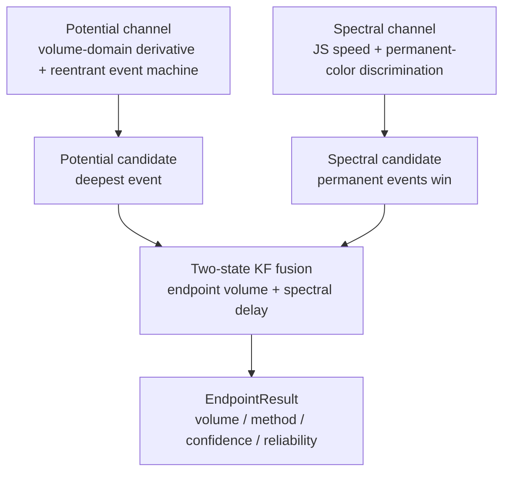

# Algorithm Technical Report: Multimodal Fusion and Titration Endpoint Detection

[中文](algorithm-report.md) | English

This document describes the actual algorithm implementation for online titration endpoint detection in AutoTitrator: the potential channel, the spectral channel, the two-state Kalman fusion, the final refinement, and the reliability diagnostics. The implementation lives in `TController/crates/controller-core/src/processing/`; the workflow wiring is in `src/workflow.rs`. The protocol and data formats are covered in companion documents.

## 1. Problem and overall design

During a titration, the sample pump injects sample into the reaction vessel and the titrant pump adds titrant at a fixed rate. The endpoint is the point of sharp change in potential or spectrum near the equivalence point. Online detection must produce a verdict while liquid is still being added, using only samples collected so far (causal).

The system uses two independent channels, each producing an endpoint candidate, then fuses them with a Kalman filter:

Both channels consume historical samples only. Either modality's endpoint can be revised later (the spectral candidate can be superseded by a stronger excursion, the potential candidate by AMPD refinement), so the KF reruns from scratch whenever the observation pair changes, rather than gating a revision with stale state.

**Adaptive thresholds** are the theme of the 2026-08 rework: the trigger thresholds of both channels are no longer pure constants but are estimated online from robust baseline-period statistics (median / MAD); the old constants are demoted to lower-bound floors. Three design constraints hold throughout:

1. **Causal**: statistics come only from samples before the baseline is armed;
2. **Degeneracy-safe**: with zero dispersion (MAD → 0) the estimate falls back to the constant floor, so behavior on flat synthetic data matches the legacy version bit-for-bit (locked by tests);
3. **Bounded**: estimates are clamped above, defending against the baseline window itself being polluted by an anomalous transient.

## 2. Potential channel

The potential channel locates the steepest downward excursion in the dE/dV curve. It works in four stages: volume-domain differentiation, smoothing, threshold estimation, and a reentrant event machine.

### 2.1 Derivative by volume (2026-08 rework)

The derivative's independent variable changed from time to volume:

$$
d_t = \frac{E_{\text{sm},t} - E_{\text{sm},t-1}}{V_t - V_{t-1}} \quad (\text{V/mL})
$$

Motivation from field data: the host timestamps contain micro-bursts (in the 2026-08-26 dataset, 15% of samples have $\Delta t < 50$ ms, minimum 0). Time-domain differentiation turned isolated samples into $-1159$ mV/s artifact spikes, whose EWMA tails dragged into a false dip that locked the endpoint at 0.735 mL while the true inflection was at 5.3–6.3 mL. Volume is quantized by pump steps and immune to timing jitter, and it matches the spectral channel's volume-anchoring semantics.

When the volume step is below `POT_DV_FLOOR = 1e-4` mL (repeated frame) or negative (non-monotonic), the derivative holds its previous level — mirroring the spectral channel's anchoring.

### 2.2 Smoothing

The voltage and its derivative each pass through a first-order causal EWMA ($\alpha_v = 0.15$, $\alpha_d = 0.05$, unchanged from the legacy version).

### 2.3 Threshold estimation (observation period)

Before the accumulated volume exceeds `POT_OBSERVE_VOL = 0.1` mL, the channel only collects derivative samples. At the end of the observation period it computes robust statistics: the median level $\tilde\mu_d$ and the MAD noise scale ($1.4826\times$ median absolute deviation). MAD is insensitive to isolated outliers in the window, unlike the sample standard deviation.

Enter/exit thresholds use a relative ladder:

$$
\Delta_{\text{enter}} = \mathrm{clip}(2.5\,\hat\sigma_d,\; \underbrace{0.02}_{\text{POT\_MIN\_ENTER}},\; \underbrace{5.0}_{\text{POT\_MAX\_ENTER}}), \qquad
\theta_{\text{enter}} = \tilde\mu_d - \Delta_{\text{enter}},\quad \theta_{\text{exit}} = \tilde\mu_d - 0.2\,\Delta_{\text{enter}}
$$

- **Floor 0.02 V/mL**: with near-zero noise the behavior falls back to the fixed legacy action;
- **Cap 5.0 V/mL**: defends against a polluted observation window pushing the threshold out of reach;
- The exit offset is a fixed ratio (`POT_EXIT_RATIO = 0.2`) of the enter offset.

When MAD is unavailable (degenerate samples), the channel falls back to the mean–standard-deviation formula with the same clipping.

### 2.4 State machine (reentrant, 2026-08 rework)

- `Idle` / `EndConfirmed` → `Tracking`: the smoothed derivative falls below the enter threshold.
- `Tracking`: new lows update the candidate volume; when the derivative rises back above the exit threshold and the volume gained since entry exceeds `POT_CONFIRM_VOL = 0.15` mL, the episode is committed as a **confirmed event** and the state returns to `EndConfirmed` (reentrant).
- The reported endpoint is the **deepest event**'s candidate volume; a later event must be deeper by `POT_SUPERSEDE_RATIO = 1.5×` to supersede.

The legacy implementation was a one-shot latch (first confirmation locked, all later dips ignored). On the 2026-08-26 dataset it locked onto a noise-induced shallow dip and completely missed the true inflection at 5.3–6.3 mL — the same failure mode the spectral channel had already fixed, so both channels now share the strongest-event semantics.

## 3. Spectral channel

The spectral channel turns "shape change" into a scalar speed that drives a reentrant state machine, with **permanent-color discrimination** applied at event commit. The main measure is the Jensen–Shannon divergence.

### 3.1 Choice of measure

The early implementation drove events with cross-entropy, which has a structural flaw: $\text{CE}(p, p)$ equals the entropy of p (≈ ln n), not 0, so the volume-normalized speed sat above the exit threshold forever. JS divergence gives $\text{JS}(p, p) = 0$ and is symmetric and bounded ($[0, \ln 2]$). `cross_entropy_excess` (KL after subtracting the self-bound) remains as the `use_jsd = false` compatibility path.

### 3.2 Volume-normalized speed

The speed is the JS divergence between the current smoothed spectrum and the **last advancing anchor frame**, divided by the squared volume step:

$$
s_t = \frac{\text{JS}(\tilde p_t,\, \tilde p_{\text{anchor}})}{\Delta V_t^2}
$$

Anchoring to the advancing frame is deliberate: in production several spectra share one pump volume, so anchoring to the previous frame would inject zero steps and dilute real events. Divergences below the rounding floor `JS_FLOOR = 1e-14` are not normalized (platform noise ~2e-12 amplified by $\Delta V^2$ is arithmetic noise).

### 3.3 Baseline and adaptive thresholds

The baseline is established within volume ≤ `SPEC_BASELINE_MAX_VOL = 0.30` mL at `SPEC_BASELINE_FRAMES = 12` frames.

Adaptive thresholds (independently switchable) are armed from two robust statistics when the baseline is established:

| Threshold | Source statistic | Formula (K=8) | Floor / Cap |
|---|---|---|---|
| enter `θ_enter` | speeds of advancing frames during baseline | median + K·MAD-σ̂ | 0.05 / 0.5 nats/mL² |
| exit `θ_exit` | fixed ratio of the enter value | 0.16 × θ_enter | — |
| base `θ_base` | JS residuals of baseline frames vs the final baseline | median + K·MAD-σ̂ | 3e-7 / 5e-5 |

The caps defend a scenario seen in the field: the baseline window polluted by an early strong transient (in-window median speed already 0.26 nats/mL²) would otherwise push the adaptive threshold out of reach. If statistics are insufficient (< 6 advancing frames) the baseline window extends to 0.45 mL; failing that, fixed constants apply for the whole run.

### 3.4 State machine (reentrant)

- `Idle` / `EndConfirmed` → `InChange`: smoothed speed ≥ enter threshold and baseline JS ≥ base threshold. A lookback window (8 frames) seeds the peak so the candidate lands on the fastest frame rather than the crossing point.
- `InChange`: new speed highs update the peak; speed falling back ≤ exit threshold accumulates recovery frames.
- `InChange` → `EndConfirmed`: recovery frames ≥ `SPEC_CONFIRM_FRAMES = 10` and event span ≥ `SPEC_MIN_EVENT_VOL = 0.08` mL — **or** the plateau path (below).

`EndConfirmed` is reentrant: excursions are recorded into an event list. This hysteresis design fixed a real regression where a one-shot latch locked the endpoint onto a transient 0.97 mL before the true endpoint.

### 3.5 Permanent-color discrimination (2026-08 addition)

Speed thresholds alone cannot separate two chemically different spectral changes:

- **Transient excursion**: color appears then fades completely back to the pre-event level (recovery ratio ≈ 1×);
- **Endpoint form switch**: the indicator changes form, partially fades, but settles at a new level clearly above the pre-event one (measured step ratio ~3200×).

The criterion is the **self-referenced recovery gap** of the baseline distance. Each event snapshots the pre-event quiet-period median level $\ell_{\text{pre}}$ and the recovery-tail median $\ell_{\text{post}}$:

$$
\ell_{\text{post}} \;\ge\; 3.0 \times \ell_{\text{pre}} + \theta_{\text{base}}
\quad\Rightarrow\quad \text{permanent}
$$

The ratio is taken against the pre-event level rather than the initial baseline, so slow drifts such as cumulative dilution cancel out. Three mechanisms:

1. **Commit-time snapshot**: the `permanent` flag is provisionally evaluated per the formula above;
2. **Retroactive demotion**: a transient can be misjudged as permanent because its recovery tail has not settled at commit time; quiet frames later re-evaluate the flag against the current level and demote + re-elect the strongest event if unsupported;
3. **Plateau confirmation**: in high-noise systems where the speed never falls back, a converged baseline-distance plateau within the episode (±35% between window halves) with a clear elevation also commits — the "step-and-hold" shape that once kept the state machine stuck in InChange for an entire run.

The selection rule upgrades accordingly: **permanent events unconditionally beat transient events** regardless of peak speed; within the same tier the 1.5× supersede hysteresis applies. The switch (`permanent_color`) is independent of the adaptive-threshold switch and can be combined with fixed thresholds; `legacy_fixed` disables everything and matches the legacy behavior bit-for-bit.

## 4. Two-state Kalman fusion

The fusion layer combines the potential and spectral endpoint candidates. Two-state linear KF: state = [endpoint volume, spectral delay].

$$
x = \begin{bmatrix} V_{\text{ep}} \\ \delta \end{bmatrix}, \qquad
H_{\text{pot}} = [1, 0], \qquad H_{\text{spec}} = [1, 1]
$$

The potential observation is directly the endpoint volume; the spectral observation is endpoint + delay, so the delay is estimated.

### 4.1 Observation model and variances

| Parameter | Value |
|---|---|
| Potential observation noise std | 0.012 |
| Spectral observation noise std | 0.025 |
| Delay std | 0.08 |
| Process noise std | 0.004 |
| Delay prior | 0.02 |
| NIS gate | 6.635 |

The first observation initializes the filter: a first potential observation sets state $[z, 0]$; a first spectral observation sets $[z - \delta_0, \delta_0]$. Later observations follow the standard predict-update with token deduplication (idempotent for repeated observations).

### 4.2 Noise-quality scaling of observation variances (2026-08 addition)

Fixed observation variances encode the signal-to-noise ratio assumed at calibration time; in noisy systems fixed R overstates confidence and loosens the NIS gate. Before the first observation of each run, each modality's R is scaled once by the normalized noise ratio $\rho$ (potential: observation-window MAD σ̂ over the deepest dip depth; spectral: baseline-period speed MAD over the strongest event's peak speed):

$$
R_m \leftarrow R_m \times \mathrm{clip}\left[(\rho_m / \rho_{\text{ref},m})^2,\; 1,\; 4\right]
$$

Reference values $\rho_{\text{ref}}$: 0.02 (both, volume domain). **One-sided amplification**: the lower bound 1 guarantees that on clean data (missing statistics count as 1) the NIS behavior matches existing results exactly; the upper bound 4 prevents extreme noise from disabling the gate entirely. The tightening direction (g < 1) is implemented but deliberately disabled until clean two-modal baseline data is available for calibration.

### 4.3 NIS gating

Each innovation is a scalar, normalized and compared against the chi-square distribution with 1 degree of freedom (99th percentile 6.635; the legacy 9.21 was a dof mismatch, now fixed). Rejected observations do not update the state and are recorded in the snapshot for diagnostics.

### 4.4 Re-fusion on observation-pair change

A superseded spectral candidate or an AMPD-refined potential candidate changes the observation pair. On change, `endpoint.rs` runs `kf.reset()` before re-observing, so revisions are never gated by stale state.

## 5. Verdict summary

`detect()` returns a result based on the two channel candidates and fusion capability:

| Potential | Spectral | KF fusable | method | confidence |
|---|---|---|---|---|
| yes | yes | yes | consensus | high |
| yes | yes | no (KF off, $\lvert\Delta V\rvert \lt 0.3$) | consensus | high |
| yes | yes | no (NIS gate failed) | conflict | low |
| yes | no | — | potential_only | medium |
| no | yes | — | spectral_only | medium |

`conflict` means "both modalities confirmed but the NIS gate rejected fusion; fall back to the potential endpoint" — it still carries potential evidence, so the workflow uses it to control the pump. `spectral_only` has no electrode evidence and never controls the pump.

**Dynamic pump-stop target**: after T=1, every decision refreshes the endpoint candidate from the latest potential-evidenced report, and the T=2 criterion ($2\times V_{\text{ep}}$) moves with it. Motivation: the reentrant event machine may revise the endpoint with a deeper later event after T=1 — if the stop target stayed frozen at the stale candidate, the pump would stop before reaching the informative region (observed as T=1 reporting 0.48 mL while the true inflection was at 5.37 mL).

## 6. Final refinement (AMPD)

When the titration reaches $2\times$ the T=1 volume or stops manually, the potential derivative is refined offline. AMPD (Automatic Multiscale Peak Detection) finds the most prominent peak on the negated derivative series, reducing per scale on the fly instead of materializing a dense matrix. Three engineering constraints come from field lessons:

- **The input is the twice-EWMA-smoothed derivative**: isolated timestamp-glitch spikes in the raw difference directly pollute multiscale detection;
- **The search is confined to a ±0.5 mL window around the strongest event's candidate**: unrestricted global search fails on non-stationary derivatives — when the reliable scale degenerates to the maximum (σ = L−1), few candidate indices remain and a trivial score wins, which once dragged a correct event to a wrong location (measured 4.20 mL vs the true ~5.37 mL);
- The peak position must lie within `AMPD_MAX_POSITION = 0.9` of the record (tail peaks lack scale support).

If the window has no AMPD peak or no confirmed event exists, the original candidate is kept. A successful refinement updates the strongest event in place so the KF re-run stays consistent.

## 7. Reliability diagnostics

`Reliability` aggregates the status and reason codes:

| Status | Meaning |
|---|---|
| CONFIRMED | both channels confirmed and KF fused |
| CONFLICT | both channels confirmed but the NIS gate rejected |
| CANDIDATE | single channel confirmed |
| CONFIRMING | either channel tracking |
| UNOBSERVABLE | no data |
| EARLY_WARNING | partial data, no candidate |

Diagnostics also carry data quality (potential/spectral sample counts, valid frames, repeated volume, non-monotonic volume, baseline readiness), the KF snapshot (endpoint_std, NIS, innovation), **adaptive threshold snapshots** (`adaptive.spectral_enter/exit/base`, `adaptive.potential_enter/exit`, omitted in legacy mode), and reason codes (`kf_innovation_gate`, `spectral_endpoint_superseded`, `baseline_pending`, …), pushed to the frontend with the `backend://state` snapshot.

## 8. Parameter quick reference

| Channel | Parameter | Value | Meaning |
|---|---|---|---|
| Potential | POT_V_ALPHA / POT_D_ALPHA | 0.15 / 0.05 | voltage / derivative EWMA |
| Potential | POT_DV_FLOOR | 1e-4 mL | advancing-volume floor (hold below) |
| Potential | POT_MIN_ENTER / POT_MAX_ENTER | 0.02 / 5.0 V/mL | adaptive offset floor / cap |
| Potential | POT_EXIT_RATIO | 0.2 | exit offset = 0.2 × enter offset |
| Potential | POT_SUPERSEDE_RATIO | 1.5 | late-event supersede factor |
| Potential | POT_CONFIRM_VOL | 0.15 mL | volume gain required to confirm |
| Spectral | SPEC_JS_ENTER / EXIT | 0.05 / 0.008 nats/mL² | fixed thresholds (= adaptive floors) |
| Spectral | adaptive K / caps | 8 / 0.5 and 5e-5 | median + 8·MAD, capped |
| Spectral | RECOVERY_GAP_RATIO | 3.0 | permanent-color recovery ratio |
| Spectral | SPEC_SUPERSEDE_RATIO | 1.5 | supersede hysteresis |
| Spectral | JS_FLOOR | 1e-14 | rounding floor |
| KF | DEFAULT_NIS_GATE | 6.635 | chi-square (dof 1) 99th percentile |
| KF | quality scaling | ×(ρ/ρ_ref)² ∈ [1,4] | one-sided amplification |
| AMPD | AMPD_MAX_POSITION / REFINE_WINDOW | 0.9 / ±0.5 mL | peak position cap / search radius |

Calibration rationale and per-dataset validation records live in `tools/adaptive_tuning_notes.md` (repository root, outside SourceCode).

## 9. Verification

- `tests/endpoint_reliability.rs`: JS symmetry/boundedness, causal features, repeated-volume level hold, supersede hysteresis, rounding floor, KF reset, AMPD vs dense reference.
- `tests/workflow.rs`: the T=1 deadlock regression (conflict verdicts with potential evidence still control the pump; spectral-only never does).
- `tests/adaptive_params.rs`: flat-baseline legacy parity (zero dispersion falls back to floors, bit-for-bit), armed thresholds land in [floor, cap], legacy mode emits no adaptive keys, one-sided KF clamping.
- `tests/potential_reentrant.rs`: a late deep dip supersedes an early shallow latch, volume-domain differentiation is immune to timestamp jitter (shuffled timestamps give identical results), fixed and adaptive modes agree.
- `tests/permanent_color.rs`: transient+permanent picks the permanent event, a pure transient is reported and later demoted, a later stronger transient cannot dethrone a permanent event.
- `examples/replay_csv.rs`: replays real titration CSVs through the production path; `--dump-stats` exports per-frame diagnostics, `--fixed` runs the fixed-threshold control.
- `tests/tmp_diff_python.rs` is a one-shot differential test against out-of-repo generated data; skipped when the file is absent.
