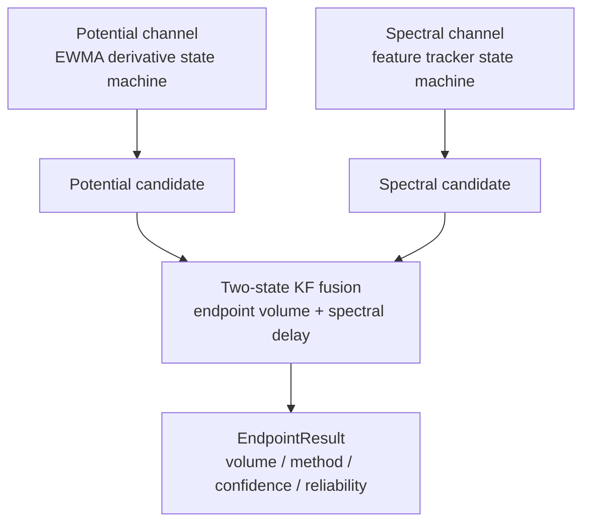

# Algorithm Technical Report: Multimodal Fusion and Titration Endpoint Detection

[中文](algorithm-report.md) | English

This document describes the actual algorithm implementation for online titration endpoint detection in AutoTitrator: the potential channel, the spectral channel, the two-state Kalman fusion, the final refinement, and the reliability diagnostics. The implementation lives in `TController/crates/controller-core/src/processing/`; the workflow wiring is in `src/workflow.rs`. The protocol and data formats are covered in companion documents.

## 1. Problem and overall design

During a titration, the sample pump injects sample into the reaction vessel and the titrant pump adds titrant at a fixed rate. The endpoint is the point of sharp change in potential or spectrum near the equivalence point. Online detection must produce a verdict while liquid is still being added, using only samples collected so far (causal).

The system uses two independent channels, each producing an endpoint candidate, then fuses them with a Kalman filter:

The system uses two independent channels, each producing an endpoint candidate, then fuses them with a Kalman filter:

Both channels consume historical samples only. Either modality's endpoint can be revised later (the spectral candidate can be superseded by a stronger excursion, the potential candidate by AMPD refinement), so the KF reruns from scratch whenever the observation pair changes, rather than gating a revision with stale state.

## 2. Potential channel

The potential channel locates the steepest downward excursion in the dV/dt curve. It works in three stages: smoothing, threshold estimation, and a state machine.

### 2.1 Smoothing

The voltage and its derivative each pass through a first-order causal EWMA:

$$
v_{\text{sm},t} = \alpha_v \, v_t + (1-\alpha_v)\, v_{\text{sm},t-1}, \qquad \alpha_v = 0.15
$$

$$
d_t = \frac{v_{\text{sm},t} - v_{\text{sm},t-1}}{t_t - t_{t-1}}, \qquad
d_{\text{sm},t} = \alpha_d \, d_t + (1-\alpha_d)\, d_{\text{sm},t-1}, \qquad \alpha_d = 0.05
$$

### 2.2 Threshold estimation (observation period)

Before the accumulated volume exceeds `POT_OBSERVE_VOL = 0.1` mL, the channel only collects derivative samples. At the end of the observation period, it uses the unbiased sample standard deviation to set two thresholds (in the negative direction, since the derivative drops sharply at the endpoint):

$$
\text{enter\_th} = \bar d - \max(\text{POT\_MIN\_ENTER},\, 2.5\,\sigma_d), \qquad \text{POT\_MIN\_ENTER} = 0.005
$$

$$
\text{exit\_th} = \bar d - \max(\text{POT\_MIN\_EXIT},\, 2.5\,\sigma_d), \qquad \text{POT\_MIN\_EXIT} = 0.001
$$

### 2.3 State machine

- `Idle` → `Tracking`: the smoothed derivative falls below the enter threshold; record the candidate volume.
- `Tracking`: when the derivative sets a new low, update the candidate volume to the minimum point.
- `Tracking` → `EndConfirmed`: the derivative rises back above the exit threshold, and the volume gained since the entry point exceeds `POT_CONFIRM_VOL = 0.15` mL.

The confirmed candidate is the potential endpoint. The thresholds use $2.5\sigma$ as a compromise that works above the noise level without mistaking normal fluctuations for an endpoint.

## 3. Spectral channel

The spectral channel turns "shape change" into a scalar speed and drives a reentrant state machine. The core metric is the Jensen–Shannon divergence.

### 3.1 Metric choice

The early implementation drove events with cross entropy:

$$
\text{CE}(p, q) = - \sum_i p_i \log q_i
$$

which has a structural flaw: $\text{CE}(p, p)$ equals the entropy of p (about $\ln n$), not 0. After dividing by the volume step squared, the speed signal saturates at a high value from the first frame, always above the exit threshold, so the state machine never leaves the change state. Switching to the JS divergence gives $\text{JS}(p, p) = 0$, and JS is symmetric and bounded (range $[0,\, \ln 2]$):

$$
\text{JS}(p, q) = \frac{1}{2} \sum_i p_i \ln\frac{p_i}{(p_i+q_i)/2} + \frac{1}{2} \sum_i q_i \ln\frac{q_i}{(p_i+q_i)/2}
$$

$\text{cross\_entropy\_excess}$ (= $\text{KL}(p \| q)$, which is 0 after subtracting its own lower bound) is kept as a compatibility path for `use_jsd = false` and does not drive the default state machine.

### 3.2 Volume-normalized speed

The speed is the JS divergence between the current smoothed spectrum and the last advancing-frame anchor, divided by the squared volume step:

$$
s_t = \frac{\text{JS}(\tilde p_t,\, \tilde p_{\text{anchor}})}{\Delta V_t^2}
$$

Anchoring to the advancing frame is deliberate. In production, one pump volume corresponds to many spectral frames; anchoring to the previous frame would inject zero steps on repeated-volume frames and dilute the real event. Anchoring to the advancing frame lets the speed filter hold its level while the volume is stationary, instead of feeding zeros.

**Rounding lower bound**: on float64, the JS rounding lower bound of a real 8-channel frame is about $5 \times 10^{-17}$ and about $2 \times 10^{-12}$ on a plateau; dividing by $\Delta V^2$ (about $2.4 \times 10^{-8}$) amplifies it about $4 \times 10^7$ times into arithmetic noise. Therefore:

$$
s_t = 0 \quad \text{when} \quad \text{JS}(\tilde p_t,\, \tilde p_{\text{anchor}}) \le \text{JS\_FLOOR} = 10^{-14}
$$

### 3.3 Baseline

While the volume stays below `SPEC_BASELINE_MAX_VOL = 0.30` mL and the frame count is below `SPEC_BASELINE_FRAMES = 12`, the tracker accumulates normalized spectra and averages them into a baseline. The baseline JS must be at least `SPEC_BASELINE_ENTER = 3e-7` for an event to start, so the state machine does not fire before the baseline is established.

### 3.4 State machine (reentrant)

- `Idle` / `EndConfirmed` → `InChange`: the smoothed speed is at least `SPEC_JS_ENTER = 0.05` and the baseline JS is at least `3e-7`. A lookback window (8 frames) seeds the peak so the candidate lands on the strongest frame in the window rather than the first threshold crossing.
- `InChange`: when the speed sets a new high, update the peak; when it falls to at most `SPEC_JS_EXIT = 0.008`, accumulate recovery frames.
- `InChange` → `EndConfirmed`: at least `SPEC_CONFIRM_FRAMES = 10` recovery frames, and the volume gained since entry is at least `SPEC_MIN_EVENT_VOL = 0.08` mL.

`EndConfirmed` is reentrant: excursions are recorded in an event list, and the reported endpoint is the strongest event so far. A later event supersedes an earlier one only if its peak speed exceeds the old peak by `SPEC_SUPERSEDE_RATIO = 1.5`. This hysteresis fixed a real regression: a one-shot latch once locked an early transient 0.97 mL before the true endpoint, and the KF gate could only reject, not correct.

## 4. Two-state Kalman fusion

The fusion layer combines the potential endpoint with the spectral endpoint into one estimate. It is a two-state linear KF: state = [endpoint volume, spectral delay].

$$
x = \begin{bmatrix} V_{\text{ep}} \\ \delta \end{bmatrix}, \qquad
H_{\text{pot}} = [1, 0], \qquad H_{\text{spec}} = [1, 1]
$$

The potential observation is the endpoint volume directly; the spectral observation equals endpoint + delay, so the delay is estimated.

### 4.1 Observation model and variances

| Parameter | Value |
|---|---|
| Potential observation noise std | 0.012 |
| Spectral observation noise std | 0.025 |
| Delay std | 0.08 |
| Process noise std | 0.004 |
| Delay prior | 0.02 |
| NIS gate | 6.635 |

The first observation decides initialization: the first potential observation sets the state to $[z,\, 0]$, the first spectral observation to $[z - \delta_0,\, \delta_0]$. Later observations follow the standard predict-update cycle, deduplicated by token so the same observation is idempotent.

### 4.2 NIS gating

The innovation of each observation is a scalar. It is normalized and compared with a chi-squared distribution with one degree of freedom:

$$
\text{NIS} = \frac{(z - H x^-)^2}{H P^- H^\top + R}, \qquad \text{accepted when NIS} \le 6.635
$$

6.635 is the 99th percentile of the chi-squared distribution with one degree of freedom. The old implementation used 9.21, the 99th percentile with two degrees of freedom; the mismatch widened the acceptance boundary. An observation rejected by the gate does not update the state and is recorded in the snapshot for diagnosis.

### 4.3 Refusing revisions with stale state

A superseded spectral candidate or an AMPD-refined potential candidate changes the observation pair. `endpoint.rs` detects the change, calls `kf.reset()`, and re-observes, so a revision is never rejected by gating against stale state.

## 5. Summary result

`detect()` returns a result based on the two channel candidates and the KF fusion state:

| Potential | Spectral | KF can fuse | method | confidence |
|---|---|---|---|---|
| yes | yes | yes | consensus | high |
| yes | yes | no (KF off and $\lvert\Delta V\rvert < 0.3$) | consensus | high |
| yes | yes | no (NIS gate rejected) | conflict | low |
| yes | no | — | potential_only | medium |
| no | yes | — | spectral_only | medium |

`conflict` means "both modalities confirmed but failed the innovation-consistency gate; fall back to the potential endpoint". It still carries potential evidence, so the workflow allows pump control. `spectral_only` has no electrode evidence, and the workflow does not allow pump control.

## 6. Final refinement (AMPD)

When the titration reaches 2x the T=1 volume or is stopped manually, the potential derivative is refined offline. AMPD (automatic multiscale peak detection) finds the most significant peak on the negated derivative sequence; the implementation reduces per-scale on the fly instead of materializing a dense matrix:

- At least 20 derivative samples are required.
- The peak must lie within `AMPD_MAX_POSITION = 0.9`: the largest scale covers only the middle of the window, so tail peaks have little scale support. 0.75 once rejected a legitimate endpoint from a manual stop slightly after the equivalence point, so the limit was relaxed to 0.9.
- The refined value overrides the candidate endpoint and triggers a KF re-fusion.

## 7. Reliability diagnostics

`Reliability` summarizes status and reason codes:

| Status | Meaning |
|---|---|
| CONFIRMED | both channels confirmed and KF fused |
| CONFLICT | both confirmed but failed the NIS gate |
| CANDIDATE | one channel confirmed |
| CONFIRMING | either channel tracking |
| UNOBSERVABLE | no data |
| EARLY_WARNING | partial data but no candidate |

The diagnostics also carry data quality (potential/spectral sample counts, valid frames, repeated volume, non-monotonic volume, baseline ready), a KF snapshot (endpoint_std, NIS, innovation), and reason codes (`kf_innovation_gate`, `spectral_endpoint_superseded`, `baseline_pending`, etc.), pushed to the frontend with the `backend://state` snapshot.

## 8. Parameter reference

| Channel | Parameter | Value | Meaning |
|---|---|---|---|
| Potential | POT_V_ALPHA / POT_D_ALPHA | 0.15 / 0.05 | voltage, derivative EWMA |
| Potential | POT_ENTER/EXIT_SIGMA | 2.5 / 2.5 | threshold sigma multiple |
| Potential | POT_CONFIRM_VOL | 0.15 mL | volume gain needed to confirm |
| Spectral | SPEC_JS_ENTER / EXIT | 0.05 / 0.008 | JS speed enter/exit threshold |
| Spectral | SPEC_SUPERSEDE_RATIO | 1.5 | supersede hysteresis multiple |
| Spectral | JS_FLOOR | 1e-14 | rounding lower bound |
| KF | DEFAULT_NIS_GATE | 6.635 | chi-squared (1 dof) 99th percentile |
| AMPD | AMPD_MAX_POSITION | 0.9 | refinement peak position limit |

## 9. Verification

- The unit tests in `tests/endpoint_reliability.rs` freeze the behavior contracts: JS symmetric and bounded, causal features, hold-on-repeated-volume, supersede hysteresis, rounding lower bound, KF reset, AMPD matching the dense reference implementation.
- `tests/workflow.rs` freezes the T=1 deadlock regression: on modal conflict, T=1 must fire whenever potential evidence exists; spectral-only must not control the pump.
- `tests/tmp_diff_python.rs` is a one-off differential test that depends on a local, repo-external data file `tmp_diff/dataA_python.json`, comparing frame by frame against the Python reference implementation on real titration data; it skips automatically when the file is missing.
