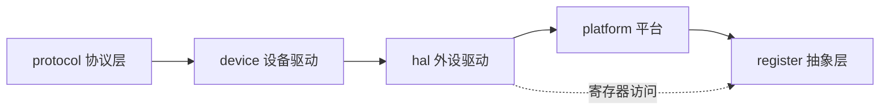
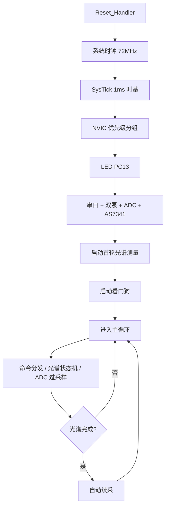

# 固件二次开发指南

[English](firmware-dev-guide_EN.md) | 中文

本文档写给要改动固件代码的开发者。固件运行在 STM32F103C8T6 上，裸机 C++23，没有 HAL、没有 RTOS、没有标准库。系统结构、构建与烧录见根 README，引脚与中断见「硬件接线」文档，协议见「通信协议」文档。

## 一、代码布局

```
src/
├── main.cpp                 # 入口，初始化 + 主循环
└── Interrupts.cpp           # ISR 桩函数
include/
├── register/                # Cortex-M3 寄存器/MMIO 抽象层（header-only）
├── stm32f103/               # 从 SVD 生成的 61 个外设头文件
├── platform/                # 系统时钟、SysTick、NVIC、IWDG
├── hal/                     # 外设驱动：GPIO、UART、TIM、ADC、I2C
├── device/                  # 设备驱动：SerialPort、PumpMotor、ADCOversample、AS7341
└── protocol/                # 帧编解码、命令解析、命令分发
Startup/
├── Vectors.cpp              # 中断向量表（weak 默认处理）
├── CXXStubs.cpp             # new/delete 陷阱、静态构造支持
└── linker.ld                # 链接脚本
```

分层关系：



## 二、启动与初始化顺序

复位后 `Reset_Handler` 调用 `main()`，按下面的顺序初始化：



1. 系统时钟：HSE 8MHz × PLL9 → SYSCLK 72MHz，总线分频，ADC 12MHz。
2. SysTick 1ms 时基（优先级 15）。
3. NVIC 优先级分组：PRIGROUP=0，4 位抢占，共 16 级。
4. LED（PC13）。
5. 串口、双泵、ADC 过采样、AS7341。
6. 启动首轮光谱测量。
7. 启动独立看门狗（~5s）。

之后进入主循环，每轮依次：命令分发、光谱状态机、ADC 过采样，然后喂狗。光谱测量完成后自动开始下一轮。

新增外设时，把它加在第 3 步之后、看门狗启动之前初始化，并把对应的 `service()` 放进主循环。

## 三、寄存器抽象层

`include/register/` 提供零开销的 MMIO 抽象，全部在编译期完成：

- `Register<T, Address>`：整寄存器读写，字段读写（RMW），以及 `Set` / `Clear` / `Modify`。
- `Field<T, Position, Width>`：位域描述，`Mask()` 用 `consteval` 在编译期算出来。
- `atomic.hpp`：`LDREX` / `STREX` 的 8/16/32 位封装。
- `concepts.hpp`：约束寄存器值必须是无符号整数、位域不能越界。

用 `stm32f103/` 下生成的头文件访问具体外设，例如：

```cpp
using namespace STM32F103;
RCC::APB2ENR::WriteIOPAEN(1);        // 使能 GPIOA 时钟
GPIOA::BSRR::Write(1u << 5);          // PA5 置高
ADC1::CR2::WriteEXTSEL(4);            // ADC 触发源 = TIM3_TRGO
```

`stm32f103/` 头文件按 SVD 的 `<access>` 属性生成方法：只读寄存器只有 `Read`，只写只有 `Write`，读写两者都有。不要手动改这些文件，改 SVD 后用 `uv run scripts/generate_stm32f103.py` 重新生成。

## 四、中断

中断向量在 `Startup/Vectors.cpp` 里以 weak 符号默认指向 `Default_Handler`。要接一个中断，在任意 `.cpp` 里定义同名的 `extern "C"` 函数即可，工程里统一放在 `src/Interrupts.cpp`。

优先级约定（0 最高，15 最低）：

| 优先级 | 中断 | 用途 |
|--------|------|------|
| 0 | USART1、DMA1_CH5 | 命令接收，不能丢帧 |
| 1 | TIM4 | 泵脉冲计数 |
| 2 | ADC1_2、I2C1_EV/ER | 采样与光谱 |
| 15 | SysTick | 时基 |

规则：

- 中断服务函数要短，只做标志置位和状态推进，耗时的搬移放到主循环。
- 跨 ISR 共享的变量声明为 `volatile`。
- 寄存器字段的 RMW 已经用短 PRIMASK 临界区保护；在 ISR 里改共享状态，需要自己处理关中断，见 `register.hpp` 的 `DisableIrqSave` / `RestoreIrq`。

## 五、协议扩展

上下行帧格式见「通信协议」文档。要加一条新命令：

1. `include/protocol/FrameCodec.hpp` 的 `downlinkParamLen` 里登记参数长度。
2. `include/protocol/CommandDispatcher.hpp` 的 `DispatcherHandler::onCommand` 里加 `case`。
3. 如果命令要触发上行上报，按 `packUplink` 的格式在 `service()` 里加一个发送分支。
4. 上位机侧在 `crates/controller-core/src/protocol/frames.rs` 同步命令与载荷长度，并加测试。

上下行命令码都要在上位机注册，否则帧会被当未知类型丢弃。

## 六、约束与注意事项

- **无堆**：`new` / `delete` 会触发死循环陷阱。需要动态内存先想清楚静态替代，或用固定大小缓冲。
- **静态构造**：`.init_array` 在 `main()` 之前由 `Reset_Handler` 调用，支持全局 C++ 对象，但构造顺序按链接顺序，依赖关系要自己保证。
- **Flash 64KB，RAM 20KB**：当前固件约 9.4KB Flash、1.3KB RAM。新增代码前看一眼 `.map` 文件，别让 .bss 悄悄涨过预算。
- **看门狗**：初始化后无法关闭，主循环必须周期性 `IWDG_::reload()`。长阻塞操作（如 I2C 恢复的 23ms）里也要喂狗。
- **I2C 时序**：读寄存器按 RM0008/AN2824 的时序实现，单字节、两字节、多字节各有讲究，改动前先读 `include/hal/I2C.hpp` 里的注释。
- **泵共享 TIM4**：两个泵共用 TIM4 时基，UPDATE 中断也是共享的。`PumpMotor::stop()` 只在两路都停后才关主计时器和中断。改这段时别破坏这个约定。

## 七、构建与验证

```sh
scons                # 构建
scons -c             # 清理
scons CROSS=arm-none-eabi-   # 指定工具链前缀
```

产物在 `build/` 下：`.elf`、`.hex`、`.map`、`.lst`。烧录用 ST-Link + OpenOCD：

```sh
openocd -f openocd.cfg
arm-none-eabi-gdb build/AutoTitrator-Firmware.elf -x .gdbinit
```

改完跑一次 `scons -c && scons`，确认 0 警告 0 错误，再核对 Flash/RAM 占用有没有异常变化。