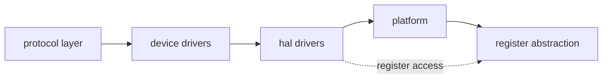
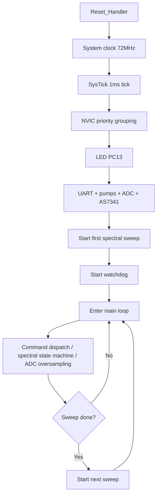

# Firmware Development Guide

[中文](firmware-dev-guide.md) | English

This document is for developers who modify the firmware. The firmware runs on an STM32F103C8T6, bare-metal C++23, with no HAL, no RTOS, and no standard library. The overall structure, build, and flashing steps are in the root README; pin and interrupt assignments are in the "Hardware Wiring" document; the protocol is in the "Communication Protocol" document.

## 1. Code layout

```
src/
├── main.cpp                 # Entry point: initialization + main loop
└── Interrupts.cpp           # ISR stub functions
include/
├── register/                # Cortex-M3 register/MMIO abstraction (header-only)
├── stm32f103/               # 61 peripheral headers generated from SVD
├── platform/                # System clock, SysTick, NVIC, IWDG
├── hal/                     # Peripheral drivers: GPIO, UART, TIM, ADC, I2C
├── device/                  # Device drivers: SerialPort, PumpMotor, ADCOversample, AS7341
└── protocol/                # Frame codec, command parser, command dispatcher
Startup/
├── Vectors.cpp              # Interrupt vector table (weak default handlers)
├── CXXStubs.cpp             # new/delete traps, static construction support
└── linker.ld                # Linker script
```

Layer relationships:



## 2. Startup and initialization order

After reset, `Reset_Handler` calls `main()`, which initializes in this order:



1. System clock: HSE 8MHz × PLL9 → SYSCLK 72MHz, bus dividers, ADC 12MHz.
2. SysTick 1ms tick (priority 15).
3. NVIC priority grouping: PRIGROUP=0, 4 preemption bits, 16 levels.
4. LED (PC13).
5. UART, both pumps, ADC oversampling, AS7341.
6. Start the first spectral sweep.
7. Start the independent watchdog (~5s).

Then the main loop runs: command dispatch, spectral state machine, ADC oversampling, then feed the watchdog. When a spectral sweep finishes, the next one starts automatically.

To add a peripheral, initialize it after step 3 and before the watchdog starts, and add its `service()` call to the main loop.

## 3. Register abstraction layer

`include/register/` provides a zero-overhead MMIO abstraction, all resolved at compile time:

- `Register<T, Address>`: whole-register read/write, field read/write (RMW), plus `Set`, `Clear`, and `Modify`.
- `Field<T, Position, Width>`: bitfield descriptor; `Mask()` is computed at compile time with `consteval`.
- `atomic.hpp`: 8/16/32-bit wrappers around `LDREX` / `STREX`.
- `concepts.hpp`: constrains register values to unsigned integers and rejects out-of-range bitfields.

Access concrete peripherals through the generated headers in `stm32f103/`, for example:

```cpp
using namespace STM32F103;
RCC::APB2ENR::WriteIOPAEN(1);        // enable GPIOA clock
GPIOA::BSRR::Write(1u << 5);          // set PA5 high
ADC1::CR2::WriteEXTSEL(4);            // ADC trigger source = TIM3_TRGO
```

The `stm32f103/` headers generate methods according to the SVD `<access>` attribute: read-only registers only get `Read`, write-only only `Write`, read-write get both. Do not edit these files by hand; regenerate them from the SVD with:

```sh
uv run scripts/generate_stm32f103.py
```

## 4. Interrupts

The vector table in `Startup/Vectors.cpp` declares every handler as a weak symbol pointing at `Default_Handler`. To hook an interrupt, define an `extern "C"` function with the same name in any `.cpp`; the project keeps them in `src/Interrupts.cpp`.

Priority convention (0 highest, 15 lowest):

| Priority | Interrupt | Purpose |
|----------|-----------|---------|
| 0 | USART1, DMA1_CH5 | Command reception; must not drop frames |
| 1 | TIM4 | Pump pulse counting |
| 2 | ADC1_2, I2C1_EV/ER | Sampling and spectrum |
| 15 | SysTick | Tick |

Rules:

- Keep ISRs short. Set flags and advance state, move heavy work to the main loop.
- Declare variables shared across ISRs as `volatile`.
- Field RMW is already protected by a short PRIMASK critical section. When an ISR modifies shared state, you must handle interrupt disabling yourself; see `DisableIrqSave` / `RestoreIrq` in `register.hpp`.

## 5. Extending the protocol

The frame formats are in the "Communication Protocol" document. To add a new command:

1. Register the parameter length in `include/protocol/FrameCodec.hpp` (`downlinkParamLen`).
2. Add a `case` in `DispatcherHandler::onCommand` in `include/protocol/CommandDispatcher.hpp`.
3. If the command must trigger an uplink report, add a send branch to `service()` following the `packUplink` format.
4. Mirror the command and its payload length in `crates/controller-core/src/protocol/frames.rs` on the host side, and add a test.

Both directions use registered command codes; anything unregistered is treated as an unknown type and discarded.

## 6. Constraints and notes

- **No heap**: `new` / `delete` trigger a trap loop. Before reaching for dynamic memory, find a static alternative or use fixed-size buffers.
- **Static construction**: `.init_array` runs before `main()` via `Reset_Handler`, so global C++ objects work, but construction order follows link order; guarantee dependencies yourself.
- **Flash 64KB, RAM 20KB**: the current firmware uses about 9.4KB of Flash and 1.3KB of RAM. Check the `.map` file after adding code so `.bss` does not quietly exceed the budget.
- **Watchdog**: once initialized it cannot be disabled; the main loop must call `IWDG_::reload()` every iteration. Long blocking operations (such as the 23ms I2C recovery) must also feed the watchdog.
- **I2C timing**: register reads follow the RM0008/AN2824 sequences; single-byte, two-byte, and multi-byte reads each have their own requirements. Read the comments in `include/hal/I2C.hpp` before touching it.
- **Pumps share TIM4**: both pumps share the TIM4 time base and its UPDATE interrupt. `PumpMotor::stop()` disables the timer and interrupt only after both channels have stopped. Do not break this when changing that code.

## 7. Build and verify

```sh
scons                # build
scons -c             # clean
scons CROSS=arm-none-eabi-   # specify a toolchain prefix
```

Artifacts land in `build/`: `.elf`, `.hex`, `.map`, `.lst`. Flash with ST-Link and OpenOCD:

```sh
openocd -f openocd.cfg
arm-none-eabi-gdb build/AutoTitrator-Firmware.elf -x .gdbinit
```

After changes, run `scons -c && scons` and confirm zero warnings and zero errors, then check that Flash/RAM usage has not changed unexpectedly.