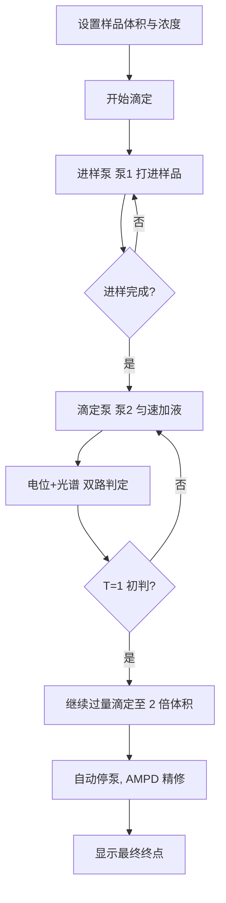

# 上位机使用手册

[English](host-user-guide_EN.md) | 中文

TController 是 AutoTitrator 的桌面端软件，跑在 Windows、macOS 或 Linux 电脑上，通过串口连接滴定仪主机，完成标定、滴定和结果查看。

本手册写给使用这台仪器做实验的人。开发相关的说明见「上位机开发者文档」，与主机通信的细节见「通信协议」文档。

## 一、安装与启动

### Windows / macOS

从发布页下载对应平台的安装包：

- Windows：`.msi` 或 `-setup.exe`
- macOS：`.dmg`

macOS 的应用没有签名。第一次打开时，在应用上点右键选「打开」；如果系统仍拦截，在终端执行：

```sh
xattr -dr com.apple.quarantine /Applications/TController.app
```

### Linux

下载 `-portable.zip` 解压后直接运行里面的可执行文件，或安装 `.deb` / `.rpm`（`sudo dpkg -i` / `sudo rpm -i`）。`.tar.gz` 是把 deb 的文件树原样打包的，解压到根目录即可：

```sh
sudo tar -xzf TController_*.tar.gz -C /
```

Linux 产物需要在 glibc 2.39 以上的系统运行（Ubuntu 24.04 及更新）。

### 数据文件

上位机运行时会读取 `calibre.npz`，里面有光谱重建矩阵和泵标定参数，必须和程序放在一起。找不到时上位机会降级：光谱通道不做重建，泵用默认参数。`settings.json` 保存界面偏好和运行历史，由程序自动生成，可以删除，删了会回到默认设置。

## 二、连接仪器

1. 用 USB 线把滴定仪主机连到电脑，主机会枚举出一个串口。
2. 打开上位机，在工具栏选端口，波特率保持 115200。
3. 点「连接」。连上后状态栏显示已连接，事件日志出现一条握手成功记录。

如果列表里没有端口，检查线缆和驱动，然后点一次刷新。一次只能连一台仪器。

## 三、标定

标定分两部分：泵标定和光谱标定。

### 泵标定

泵标定是把"泵步数"和"实际液体体积"对应起来。蠕动泵用久了会磨损，换管后也需要重新标。

1. 切到「标定」页，泵 2 工作区。
2. 选滴定泵（泵 2），在「排出」输入一个步数，点「排出」，把液体排到称量容器。
3. 记录称量得到的体积，点「记录点」。
4. 重复几次，覆盖从空管到接近满程的范围，至少 10 个点。
5. 左侧出现拟合预览和斜率、截距、R²。R² 接近 1 说明线性好，标定可用。
6. 满意后点「应用标定」，程序把参数写回 `pump2_calibration.json`。

清空点会放弃本次拟合，不会影响已应用的标定。

### 光谱标定

光谱标定使用出厂时测得的 Golden Device 矩阵，放在 `calibre.npz` 的 `spectral_matrix` 键里。上位机只负责加载和展示，不在这里做重新标定。「标定」页顶部的色块和曲线是这张矩阵的样子，方便核对加载的是不是预期数据。

## 四、做一次滴定

1. 在「滴定工作台」设置样品体积（进样量，mL）。
2. 打开「滴定剂浓度」和「计量比 a∶b」，终点确认后会自动算出分析物浓度。
3. 点「开始滴定」。

工作流程是自动的：



1. 进样泵（泵 1）把样品打进反应杯，直到设定的体积。
2. 进样完成，滴定泵（泵 2）开始以固定速度加滴定剂。
3. 上位机实时看电位曲线和光谱，双路信号在终点附近会先后给出判断。
4. T=1 初判出现后提示一个候选终点，同时继续过量滴定直到 2 倍体积。
5. 到达后自动停泵，用 AMPD 对电位曲线做一次离线精修，给出最终终点。

滴定过程中随时可以「手动停止」（会立即用已有数据做精修），或「中止」（回到待机，保留曲线不写入结果）。「急停」会立刻让所有泵停下并复位工作流。

结果面板显示终点体积、判定方法、置信度、可靠性，以及由滴定剂浓度和计量比换算出的分析物浓度。

## 五、查看结果与导出

「数据记录」页列出历次运行：时间、时长、样品量、终点、方法、置信度、状态。支持导出 CSV，字段包含时间、体积、电位、泵位置等，用表格软件打开即可。

同一次滴定的记录在结束后自动写入，最多保留最近 30 条。

## 六、日常维护

### 管路操作

「滴定工作台」和「维护」页都提供管路操作：

- 预充：把滴定剂灌满管路。入口放进液体里，看到管里没有气泡后停止。
- 排空：把管路里的液体清掉。出口放进废液杯，排空后停止。

管路操作使用自由运行模式，需要人工观察并点停止，程序不会自动停。

### 看门狗

固件带一个看门狗：上位机每 1 秒发一次心跳，5 秒收不到就判定断线，自动停泵。默认开启。「维护」页可以关掉，但建议保持开启，避免拔线后泵失控。

## 七、常见问题

**连不上串口。** 看端口列表里有没有设备，重新插拔 USB；macOS/Linux 检查是否有权限访问串口设备节点。

**标定拟合的 R² 很低。** 检查是否换了管没重新标、管路里有没有气泡、称量读数是否准确。

**光谱区域显示"等待数据"。** 检查 AS7341 接线（见硬件接线文档）和 `calibre.npz` 是否存在。

**结果里没有分析物浓度。** 需要在开始滴定前设置滴定剂浓度和计量比。

**程序打不开。** macOS 未签名应用需要右键打开并清除隔离属性；Linux 检查 glibc 版本。