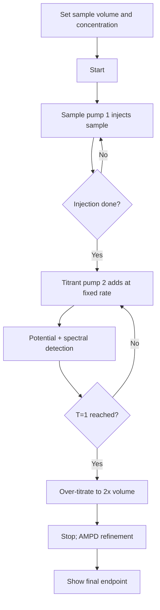

# Host Application User Guide

[中文](host-user-guide.md) | English

TController is the desktop application for AutoTitrator. It runs on Windows, macOS, or Linux, connects to the titrator main unit over a serial port, and handles calibration, titration, and result review.

This guide is for people who run experiments on the instrument. Developers should read the "Host Application Developer Guide", and anyone integrating with the communication protocol should read the "Communication Protocol" document.

## 1. Installation and startup

### Windows / macOS

Download the installer for your platform from the releases page:

- Windows: `.msi` or `-setup.exe`
- macOS: `.dmg`

The macOS app is not signed. On first launch, right-click the app and choose "Open". If the system still blocks it, run this in a terminal:

```sh
xattr -dr com.apple.quarantine /Applications/TController.app
```

### Linux

Download `-portable.zip`, unpack it, and run the executable inside. Alternatively install the `.deb` or `.rpm` package (`sudo dpkg -i` / `sudo rpm -i`). The `.tar.gz` archive contains the same file tree as the deb package; unpack it at the root:

```sh
sudo tar -xzf TController_*.tar.gz -C /
```

The Linux build requires glibc 2.39 or newer (Ubuntu 24.04 and later).

### Data files

The application reads `calibre.npz` at startup. It holds the spectral reconstruction matrix and the pump calibration parameters and must be placed next to the executable. If it is missing, the application degrades: the spectral channel is not reconstructed and the pumps fall back to default parameters. `settings.json` stores interface preferences and run history; it is created automatically and can be deleted to reset to defaults.

## 2. Connecting to the instrument

1. Connect the titrator main unit to the computer with a USB cable. The unit enumerates a serial port.
2. Open the application, select the port in the toolbar, and keep the baud rate at 115200.
3. Click "Connect". When connected, the status bar shows Connected and a handshake success entry appears in the event log.

If no port appears in the list, check the cable and driver, then refresh. Only one instrument can be connected at a time.

## 3. Calibration

Calibration has two parts: pump calibration and spectral calibration.

### Pump calibration

Pump calibration maps pump steps to actual liquid volume. Peristaltic pumps wear with use, so recalibrate after replacing the tubing.

1. Switch to the Calibration page, pump 2 workbench.
2. Select the titrant pump (pump 2), enter a step count in "Dispense", and click "Dispense" to pump liquid into a weighing container.
3. Record the weighed volume and click "Add point".
4. Repeat several times, covering from empty tubing to near full stroke. At least 10 points.
5. The fit preview, slope, intercept, and R² appear on the left. An R² close to 1 means the fit is good and the calibration is usable.
6. When satisfied, click "Apply". The application writes the parameters to `pump2_calibration.json`.

Clearing the points discards the current fit and does not affect the applied calibration.

### Spectral calibration

Spectral calibration uses the Golden Device matrix measured at the factory, stored in the `spectral_matrix` key of `calibre.npz`. The application only loads and displays this matrix; it does not recalibrate here. The color swatches and curves at the top of the Calibration page show what was loaded, so you can verify it matches expectations.

## 4. Running a titration

1. On the Titration workbench, set the sample volume (injection volume, mL).
2. Set the titrant concentration and the stoichiometric ratio a∶b. The analyte concentration is computed automatically once the endpoint is confirmed.
3. Click "Start".

The workflow is automatic:



1. The sample pump (pump 1) injects sample into the reaction vessel until the set volume.
2. When injection finishes, the titrant pump (pump 2) adds titrant at a fixed rate.
3. The application watches the potential curve and the spectrum live; the two signals each give a verdict near the endpoint.
4. After the T=1 first pass, it reports a candidate endpoint and continues over-titrating to 2x the volume.
5. At that point it stops automatically and runs AMPD on the potential curve offline to produce the final endpoint.

At any time during titration you can click "Manual stop" (it refines with the data collected so far) or "Abort" (returns to idle, keeps the curves, does not write a result). "E-STOP" stops all pumps immediately and resets the workflow.

The results panel shows the endpoint volume, method, confidence, reliability, and the analyte concentration derived from the titrant concentration and the ratio.

## 5. Reviewing results and exporting

The Records page lists each run: time, duration, sample volume, endpoint, method, confidence, and status. It supports CSV export with fields such as time, volume, potential, and pump position, which you can open in a spreadsheet.

Each run is written automatically when it finishes. The list keeps the most recent 30 runs.

## 6. Routine maintenance

### Tubing operations

Both the Titration workbench and the Maintenance page offer tubing operations:

- Prime: fill the tubing with titrant. Put the inlet into the liquid and stop once no bubbles remain.
- Empty: clear liquid out of the tubing. Put the outlet into a waste cup and stop when empty.

Tubing operations run in free-run mode; watch them and click stop manually. The application does not stop them automatically.

### Watchdog

The firmware has a watchdog: the application sends a heartbeat every second, and if none arrives within 5 seconds the firmware considers the link lost and stops the pumps. It is enabled by default. The Maintenance page can disable it, but it is safer to keep it on so the pumps cannot run away after the cable is unplugged.

## 7. Troubleshooting

**Cannot connect to the serial port.** Check that a device appears in the port list and re-seat the cable. On macOS/Linux, check that you have permission to access the serial device node.

**The calibration fit has a low R².** Check whether the tubing was changed without recalibrating, whether there are bubbles in the tubing, and whether the weighing readings are accurate.

**The spectral area shows "Waiting for data".** Check the AS7341 wiring (see the Hardware Wiring document) and whether `calibre.npz` exists.

**No analyte concentration in the result.** Set the titrant concentration and the ratio before starting the titration.

**The application will not open.** On macOS, the unsigned app needs right-click Open and the quarantine attribute removed. On Linux, check the glibc version.