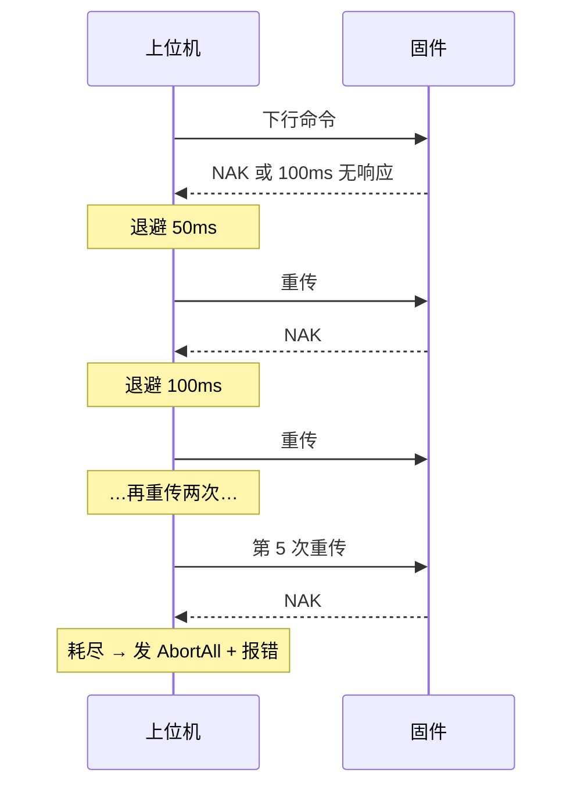

# 通信协议

[English](protocol_EN.md) | 中文

固件（STM32F103）与上位机（TController）通过串口通信。本文档描述两者之间的帧格式、命令和事件，供需要对接协议或排查通信问题的开发者阅读。实现代码见固件 `include/protocol/` 与后端 `crates/controller-core/src/protocol/`。

## 一、总体

- 串口参数：115200-8N1。
- 帧分两类：上行帧（固件发给上位机）和下行帧（上位机发给固件）。
- 所有多字节整数都是小端序。
- 每帧带一个 CRC-8 校验，多项式 `0x31`（Maxim-Dallas 变体），初值 0。

上行帧以 `AA 55` 开头，下行帧以 `BB 55` 开头。帧正文（类型/命令 + 数据）参与 CRC 计算，帧头不参与。

```
上行：AA 55 | 类型(1B) | 数据(NB) | CRC8(1B)
下行：BB 55 | 命令(1B) | 参数(NB) | CRC8(1B)
```

最大帧长 26 字节（光谱帧），小于固件发送缓冲 32 字节与接收缓冲 64 字节，不会截断。

## 二、下行命令（上位机 → 固件）

| 命令 | 名称 | 参数 | 固件行为 |
|------|------|------|----------|
| 0x01 | MaxCount | pump_id(1) + count(4) | 泵定量运行，到达 count 步后自动停止 |
| 0x02 | FreeRun | pump_id(1) | 泵自由运行，直到收到停止命令 |
| 0x03 | FreeStop | pump_id(1)，0xFF 表示全部 | 正常停止，停止后无位置上报 |
| 0x04 | AbortAll | pump_id(1)，0xFF 表示全部 | 紧急停止，功能与 0x03 相同，语义用于异常场景 |
| 0x05 | Heartbeat | 0x01 使能，0x00 关闭 | 使能后固件每 1 秒回一条心跳帧；同时开启看门狗 |
| 0x06 | Reset | 无 | 回 ACK，等 10 毫秒后复位 MCU |

泵号 1 是进样泵（TIM4 CH1），泵号 2 是滴定泵（TIM4 CH2）。

命令执行成功回 `0x00 ACK`，参数非法或未知命令回 `0x01 NAK`。0x03 与 0x04 实现完全相同，保留两个命令码是为了在日志里区分正常停止与异常中止。

## 三、上行帧（固件 → 上位机）

| 类型 | 名称 | 数据 | 触发条件 |
|------|------|------|----------|
| 0x00 | ACK | echo_cmd(1) | 收到合法命令 |
| 0x01 | NAK | echo_cmd(1) | 校验失败或未知命令 |
| 0x10 | PumpPos | pump_id(1) + position(4) | 每累计 1000 脉冲上报一次 |
| 0x11 | PumpDone | pump_id(1) + position(4) | MaxCount 定量完成 |
| 0x20 | ADC | sum(4) + samples(2) + shift(1) + pump2_pos(4) | 一次过采样完成（256 次，由主循环拉取） |
| 0x30 | Spectral | 10 × uint16 LE + reserved(2)，共 22 字节 | AS7341 一轮扫描完成 |
| 0x40 | Heartbeat | uptime_ms(4) | 心跳使能后每 1 秒 |

### 0x20 ADC 帧说明

固件对 ADC1 做 256 次累加过采样。原始值是 12 位右对齐，累加后得到 `sum`，实际有效读数 = `sum >> shift` 再取低 16 位。`samples` 是参与累加的采样次数（正常为 256），`shift` 是右移位数（正常为 4）。

`pump2_pos` 是过采样结束时刻泵 2 的脉冲计数，上位机把它换算成滴定剂体积，用来把电位数据和体积画在同一条时间轴上。电位换算公式（软件放大后的偏移值）：

$$
V(\text{V}) = \frac{(\text{sum} \gg \text{shift}) \times 3.3}{65535} - 1.1
$$

### 0x30 Spectral 帧说明

AS7341 有 8 个可见光通道（F1 到 F8）加一个 Clear 和一个 NIR，共 10 个 16 位值，小端序排列。两个 phase 各扫一次，Clear 和 NIR 在固件里取了两次平均。帧尾 2 字节保留，固定为 0。

通道波长对应：F1≈415nm，F2≈445nm，F3≈480nm，F4≈515nm，F5≈555nm，F6≈590nm，F7≈630nm，F8≈680nm，Clear 全波段，NIR≈910nm。

## 四、时序与重试

上位机发送命令后等待 ACK 或 NAK：

- 首包超时 100 毫秒。
- 收到 NAK 或首包超时，按指数退避重传，最多重试 5 次。
- 重试耗尽后上位机发送 `AbortAll`（0x04 0xFF）并报「下位机通讯异常」。

任一时刻只有一条命令在等待确认。心跳不占用这个槽位：有命令在等确认时，心跳帧直接跳过，避免覆盖命令的确认状态。

串口读取本身不设命令级超时，空闲时每 5 毫秒轮询一次。



## 五、看门狗

固件看门狗由下行 `0x05` 使能。上位机连接期间每 1 秒发一次心跳；固件 5 秒没有收到心跳就把两个泵都停下，防止上位机掉线后泵失控。心跳帧同时带一个 `uptime_ms`，上位机用它显示固件运行时间。

## 六、边界情况

- **CRC 错误的上行帧**：固件收到 CRC 不对的下行帧回 NAK；上位机收到坏的上行帧直接丢弃，不产生事件。
- **未知类型**：两端都丢弃并继续等下一帧。
- **重同步**：上位机解析器允许在 `AA` 和 `55` 之间夹杂干扰字节后重新同步；连续两个 `BB` 时，固件把第二个 `BB` 当作新帧头处理。
- **ACK/NAK 失配**：上位机收到与当前等待命令号不符的 ACK 时，记一条错误事件便于排查，不会清掉当前 pending 命令。