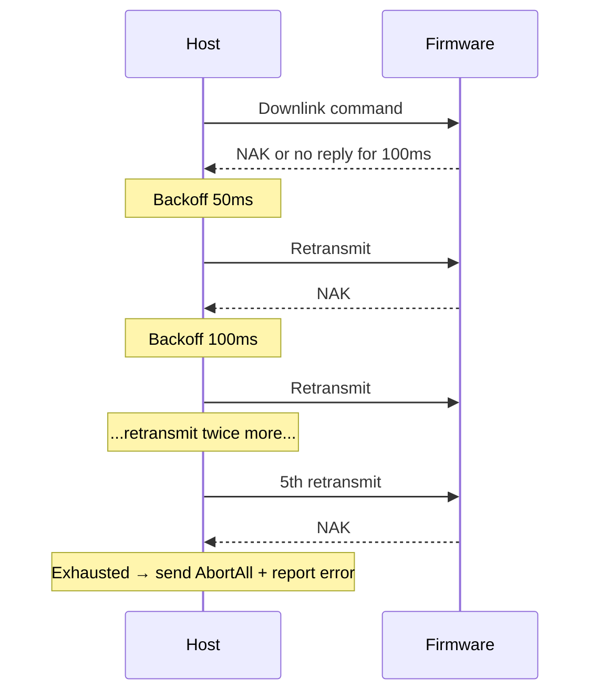

# Communication Protocol

[中文](protocol.md) | English

The firmware (STM32F103) and the host application (TController) communicate over a serial port. This document describes the frame formats, commands, and events between the two, for developers who need to integrate with the protocol or debug communication issues. The implementation lives in the firmware `include/protocol/` directory and the backend `crates/controller-core/src/protocol/` crate.

## 1. Overview

- Serial parameters: 115200-8N1.
- Frames come in two directions: uplink (firmware to host) and downlink (host to firmware).
- All multi-byte integers are little-endian.
- Every frame carries a CRC-8 checksum, polynomial `0x31` (Maxim-Dallas variant), initial value 0.

Uplink frames start with `AA 55`; downlink frames start with `BB 55`. The CRC covers the body (type/command + data) but not the header.

```
Uplink:   AA 55 | type(1B) | data(NB) | CRC8(1B)
Downlink: BB 55 | cmd(1B)   | params(NB) | CRC8(1B)
```

The largest frame is 26 bytes (the spectral frame), smaller than the firmware's 32-byte transmit buffer and 64-byte receive buffer, so frames never truncate.

## 2. Downlink commands (host → firmware)

| Command | Name | Parameters | Firmware behavior |
|---------|------|------------|-------------------|
| 0x01 | MaxCount | pump_id(1) + count(4) | Run the pump for a fixed number of steps, then stop automatically |
| 0x02 | FreeRun | pump_id(1) | Run the pump until a stop command is received |
| 0x03 | FreeStop | pump_id(1), 0xFF means all | Normal stop; no position report after stopping |
| 0x04 | AbortAll | pump_id(1), 0xFF means all | Emergency stop; functionally identical to 0x03, kept for semantic distinction |
| 0x05 | Heartbeat | 0x01 enables, 0x00 disables | When enabled, the firmware replies with a heartbeat frame every second and arms the watchdog |
| 0x06 | Reset | none | Reply ACK, wait 10 ms, then reset the MCU |

Pump 1 is the sample pump (TIM4 CH1); pump 2 is the titrant pump (TIM4 CH2).

A successful command is answered with `0x00 ACK`; invalid parameters or an unknown command are answered with `0x01 NAK`. Commands 0x03 and 0x04 are implemented identically; both codes are kept so logs can distinguish a normal stop from an abnormal abort.

## 3. Uplink frames (firmware → host)

| Type | Name | Data | Trigger |
|------|------|------|---------|
| 0x00 | ACK | echo_cmd(1) | Valid command received |
| 0x01 | NAK | echo_cmd(1) | Checksum failure or unknown command |
| 0x10 | PumpPos | pump_id(1) + position(4) | Every 1000 accumulated pulses |
| 0x11 | PumpDone | pump_id(1) + position(4) | MaxCount run completed |
| 0x20 | ADC | sum(4) + samples(2) + shift(1) + pump2_pos(4) | One oversampling run finished (256 samples, pulled by the main loop) |
| 0x30 | Spectral | 10 × uint16 LE + reserved(2), 22 bytes total | One AS7341 sweep finished |
| 0x40 | Heartbeat | uptime_ms(4) | Every second while heartbeat is enabled |

### The 0x20 ADC frame

The firmware accumulates 256 samples of the ADC1. The raw value is 12-bit right-justified; the accumulation produces `sum`. The effective reading is `sum >> shift` truncated to the low 16 bits. `samples` is the number of samples accumulated (normally 256) and `shift` is the right-shift amount (normally 4).

`pump2_pos` is the pump 2 pulse count when the oversampling run finished. The host converts it to titrant volume so that potential and volume share a time axis. The potential conversion (including the software offset):

$$
V(\text{V}) = \frac{(\text{sum} \gg \text{shift}) \times 3.3}{65535} - 1.1
$$

### The 0x30 Spectral frame

The AS7341 has eight visible-band channels (F1 to F8) plus Clear and NIR: ten 16-bit values, little-endian. Each scan has two phases; the firmware averages Clear and NIR over the two phases. The last 2 bytes are reserved and fixed to 0.

Channel wavelengths: F1≈415nm, F2≈445nm, F3≈480nm, F4≈515nm, F5≈555nm, F6≈590nm, F7≈630nm, F8≈680nm, Clear full-band, NIR≈910nm.

## 4. Timing and retries

After sending a command, the host waits for an ACK or NAK:

- First-packet timeout: 100 ms.
- On NAK or first-packet timeout, the host retransmits with exponential backoff, up to 5 attempts.
- When retries are exhausted, the host sends `AbortAll` (0x04 0xFF) and reports "lower-computer communication error".

Only one command waits for confirmation at a time. Heartbeats do not occupy this slot: while a command is pending, heartbeat frames are skipped so they cannot overwrite the command's confirmation state.

Serial reads have no command-level timeout; the port is polled every 5 ms while idle.



## 5. Watchdog

The firmware watchdog is armed by the downlink command `0x05`. While connected, the host sends a heartbeat every second. If the firmware receives no heartbeat within 5 seconds, it stops both pumps to prevent them from running away after the host disconnects. The heartbeat frame also carries `uptime_ms`, which the host uses to show the firmware uptime.

## 6. Edge cases

- **Uplink frame with a bad CRC**: the firmware replies NAK to a downlink frame with a bad CRC; the host drops a corrupted uplink frame without generating an event.
- **Unknown type**: both ends discard it and keep waiting for the next frame.
- **Resynchronization**: the host parser allows stray bytes between `AA` and `55` and still resynchronizes; on two consecutive `BB` bytes, the firmware treats the second `BB` as a new frame header.
- **Mismatched ACK/NAK**: when the host receives an ACK whose command number does not match the pending command, it logs an error event for diagnosis without clearing the pending command.